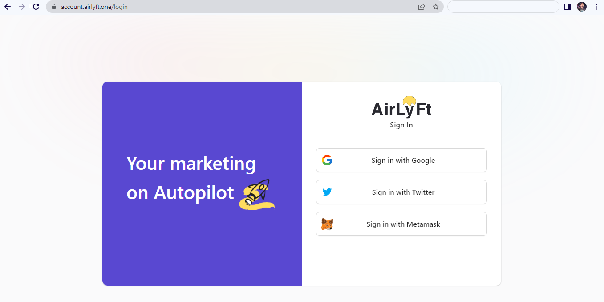
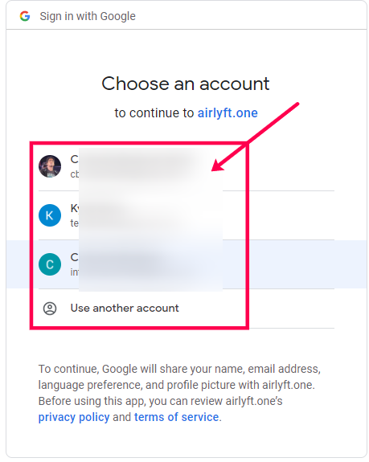
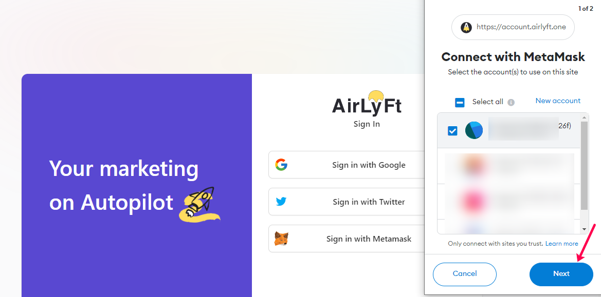
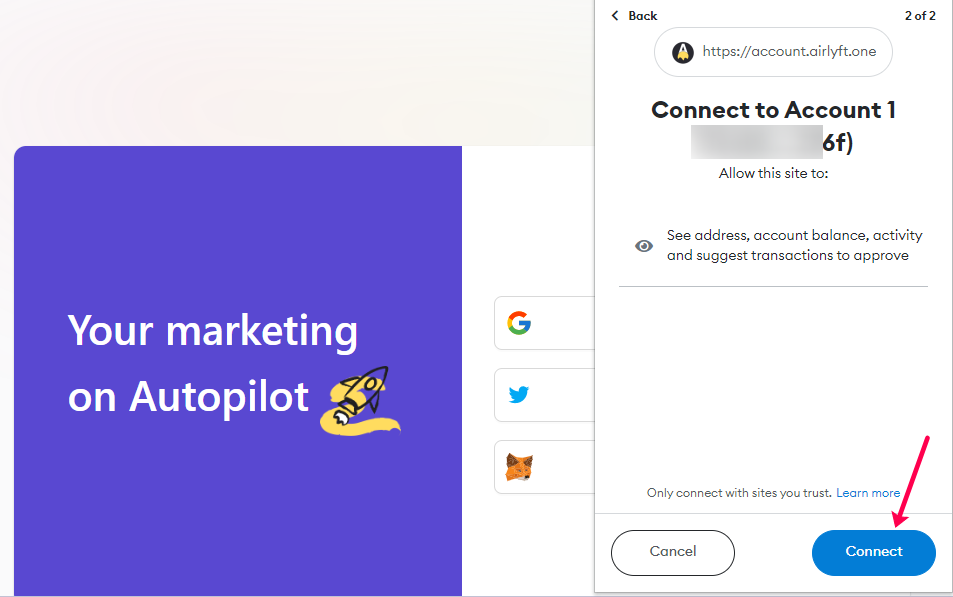

Ahoy mate! Welcome to the world of decentralized marketing or in more simpler terms decentralized growth. Let’s start with the very first learning session of AirLyft which is logging into AirLyft.One application. 

* Access your favorite browser and navigate to the website “https://account.airlyft.one/login” ! Allow the page to load and you can then see 3 modes of login with Google, Twitter, Metamask.
  

     
* If you are Signing in with Google, click on the first option and it will redirect you to Google Oauth page where you can select your desired account to login and then access AirLyft. 

> *If you take a quick look at the very end of the OAUTH page, you can see what exactly does AirLyft collect 
during a Google login which is just Name, Email Address, Profile Picture, and Language Preference that AirLyft can use for your account. Please note that these are all public information that can be shared publically.* 

* Next, is that you can also use login mode as Twitter where you would need to Aurthorize Twitter Application to login to AirLyft. Just click on Sign In with Twitter and then click on Authorize button to move forward with account creation. 

 

> Now, please do take a look at the point stated just below the Authorize button where you can see what data AirLyft collects when you authorize which is just simple READ ONLY public information that includes Seeing Tweets, Twitter Profile Views, Your followed accounts and your email address for login purposes into AirLyft. Please note that we don’t have any access over it and it is used just to fill your public information in AirLyft.

* Lastly, you can also use Metamask to login and create your account at AirLyft. Just click on Sign in with Metamask and then select the wallet address with which you want to login. 

Once account is selected, click on Next button where you would get an option to click on Connect and move forward with account creation. 

> Take a look at what information is accessed by AirLyft while you connect with Metamask. AirLyft only will be able to see address, account balance, activity and suggest transactions to approve. This is the by default access provided by wallet in a 3rd party interaction. 

And Wohoo… Congratulations! Your account at AirLyft is created and you can use the same login method moving forward to resume your work at AirLyft. Should you have any questions regarding login, please feel free to drop a line at official channels below. 

Official Email Address: support@kyte.one 

Official Telegram: https://t.me/kyteone

LYFT OFF!!!  
 