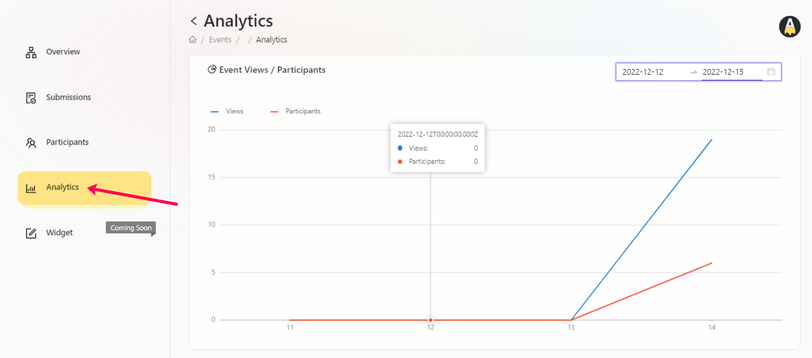

# Analytics

## Over all analytics

## Task wise analytics

AirLyft provides its projects the flexibility to track their campaign performance analytically. While there are hundreds of analytical development that can be brought in, however, we have current developed our Analytics module based on certain parameter which is required by projects on day to day basis. To check for event analytics, please follow the steps below.

- Login to AirLyft and once you are on the dashboard, please click on events tab as shown in the screenshot below.

- After you are on the event page, select the corresponding event for which you want to check the participant data and click on View button. 

- Next, click on Analytics tab as shown in the screenshot below to get an analytical insight of your campaign performance. AirLyft provides analytics insights on both event level and task level. Please use this feature wisely to understand the drop off points and strategize your campaign accordingly.

> **NOTE:** We are developing fast and trying to meet all users requirements. If you have any requests with enhancement of analytics feature, please feel free to drop a line to us on our official channels or email address. Our product team will look into it and share an implementation date at the earliest. 

:::tip This document is in progress, for instant help

1. Email us at support@kyte.one
2. Join [this Telegram group](https://t.me/kyteone): https://t.me/kyteone

**_The AirLyft Team is there to help you. AirLyft is a platform to run marketing events, campaigns, quests and automatically distribute NFTs or Tokens as rewards._**

:::