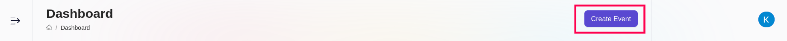
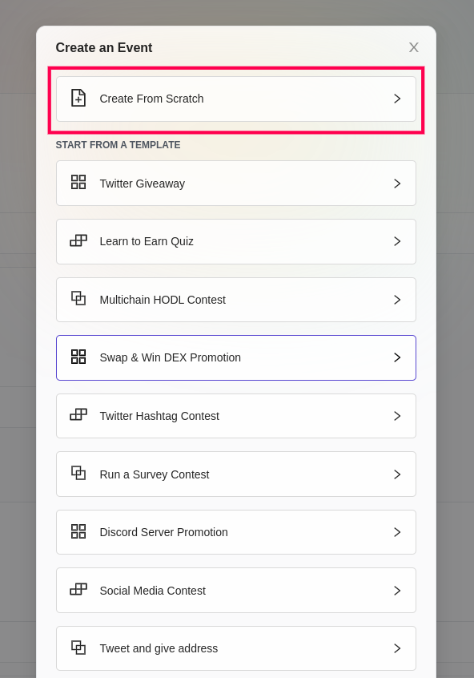
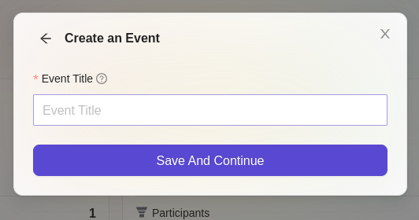
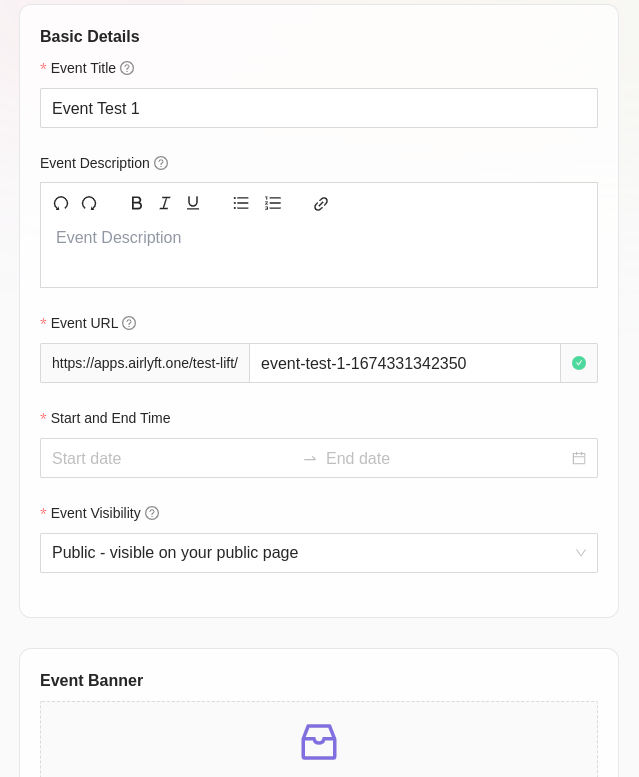
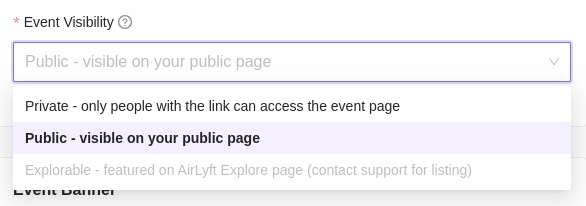
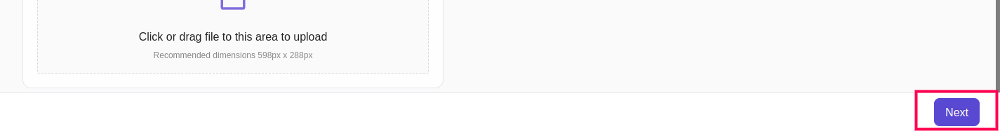
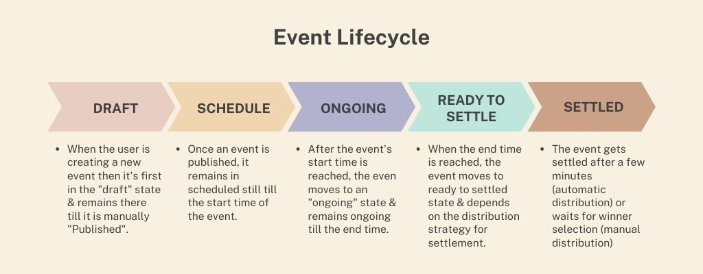

# Event

## Create
This tutorial focuses on how to create and update the event in AirLyft. An event is a simple marketing campaign where you will get a dedicated webpage in which you can specify all the event details like name, description, event banner, start date and end date if it's not an ongoing event. You can also configure which actions you want the users to perform which can be social, quiz, form or on-chain. Let's dive deep into how to create a new project within AirLyft. 

- Firstly, login to your AirLyft account with which you have signed in earlier and go to your dashboard. 

- Next, headover to top right part of your screen where you can see the button "Create Event". Click on the button as shown in screenshot below. 

- Upon clicking the button, you will get a list of options like "Create from Scratch" or select from a range of templates. Click on "Create from Scratch" for now. To know the steps for creation from template is here. 

- In the pop up, please enter event name and click on Save and Continue button. 

- On the Event details page, you can add the event description, start date, end date, event banner. You will see that the event link will be automatically be filled but you can change that. For the event link only special characters like - and _ are allowed. 

- On the Event details page, the "Event Visibility" option allows you to ensure that your event appiers in your project page in the AirLyft App section if you select "Public - Visible in your public page" and only the users with the link can access the page if you select "Private - only people with the link can access the event page". The Public option is selected by default.

- On clicking Next which is on the bottom right, you will be taken to the "Tasks" section.

## Update

Event details can only be updated when the event is in "Scheduled" state. Once the event moves to "Ongoing" or "Ready to settle" then the event details cannot be updated.

## Event lifecycle

| Event State | What can be updated |
| - | - |
| Draft | All fields |
| Scheduled | All fields |
| Ongoing | Title, Description, Banner, Tasks (Tasks that already have participants cannot be removed). (Start date, End Date, URL and Giveaway can't be edited) |
| Ready to settle | Title, Description, Banner, Tasks (Tasks that already have participants cannot be removed). (Start date, End Date, URL and Giveaway can't be edited) |
| Settled | Title, Description, Banner |

:::note

In case you are editing a task that already has participants, the earlier particaption entries remain unchanged.

:::