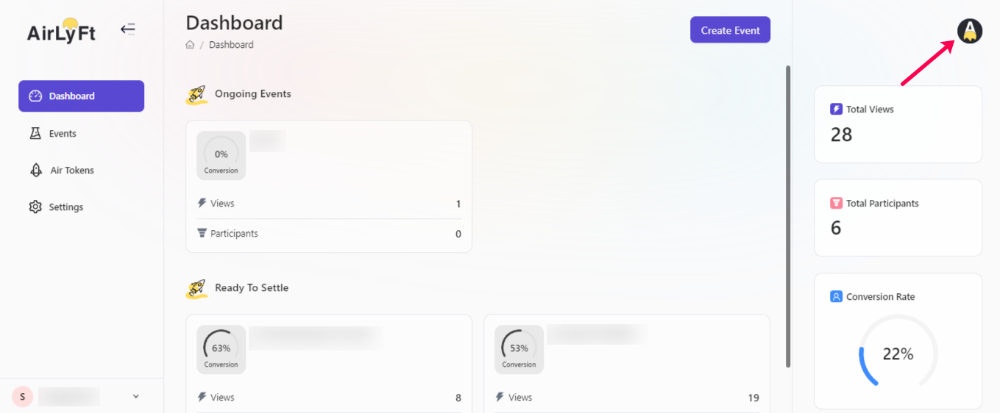

# Logout

To logout from your AirLyft account, please follow the steps below.

- After your work has been completed on AirLyft, headback to the dashboard page, and move to the top right corner of the screen where you can find your profile option. Click on it.

- Once you click on the profile picture, you can find the Logout Option as shown in the screenshot below. Click on it. 

And that's it... You have been successfull logged out and redirected to the login page of account website.

:::tip For instant help

1. Email us at support@kyte.one
2. Join [this Telegram group](https://t.me/kyteone): https://t.me/kyteone

:::