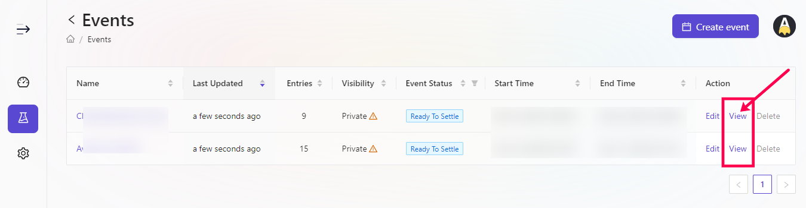
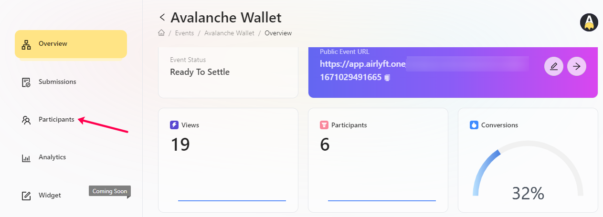
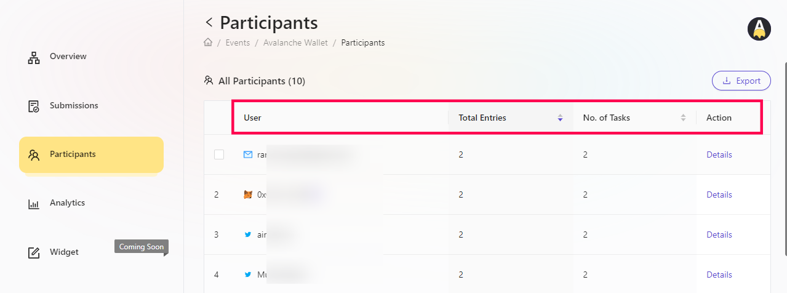

# Participant List View

AirLyft provides projects the flexibility to view participants entries at any point during the event. You can check on a overall scale the number of the entries a particular user has scored, the number of tasks they have completed, and also check on what actions have they performed as a part of this event. Let's take a deep look at where can we view the participant list. 

- Login to AirLyft and once you are on the dashboard, please click on events tab as shown in the screenshot below.

- After you are on the event page, select the corresponding event for which you want to check the participant data and click on View button. 

- You are now on the event overview page. Next step is to click on participants tab where you can see all cumulative data of your participants in a single page. 

- The current view provides a overall view of users who have participated from multiple sources such as Email, Metamask, Twitter, Telegram etc. You can also view what are the entries a particular user has been rewarded and how many tasks have they completed.
  

- Alternatively, if you want to check for what all tasks has a particular user completed, you can simply click on the Details option specific to that user and check the drill down of different actions performed by them on this event. 

:::tip This document is in progress, for instant help

1. Email us at support@kyte.one
2. Join [this Telegram group](https://t.me/kyteone): https://t.me/kyteone

**_The AirLyft Team is there to help you. AirLyft is a platform to run marketing events, campaigns, quests and automatically distribute NFTs or Tokens as rewards._**

:::
