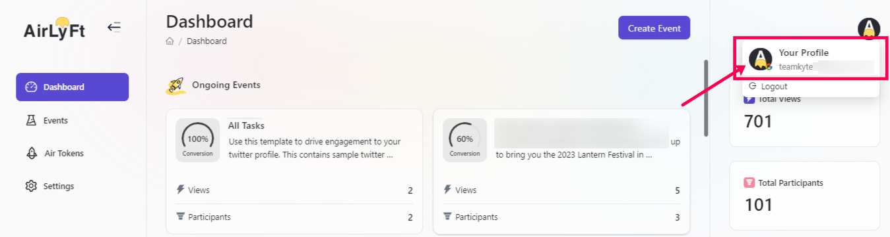
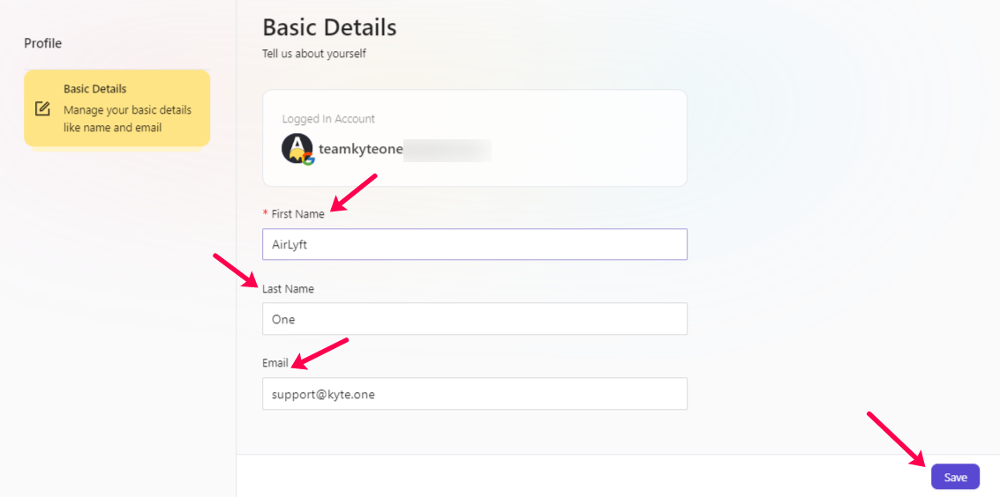

# Profile

To edit the logged in users profile information on AirLyft, please follow the steps below.

- Login to AirLyft with the same account for which you want to edit the profile and land at the dashboard. 
- On dashboard page, move to the top right corner of the screen where you can find your profile option. Click on it.

- You will now be redirected to the Basic Details page where you can fill up or change your First Name, Last Name, and Email address. 

- After you have done your changes, please make sure to click on the Save button and the bottom right corner of your screen for the changes to take effect. 

:::tip For instant help

1. Email us at support@kyte.one
2. Join [this Telegram group](https://t.me/kyteone): https://t.me/kyteone

:::