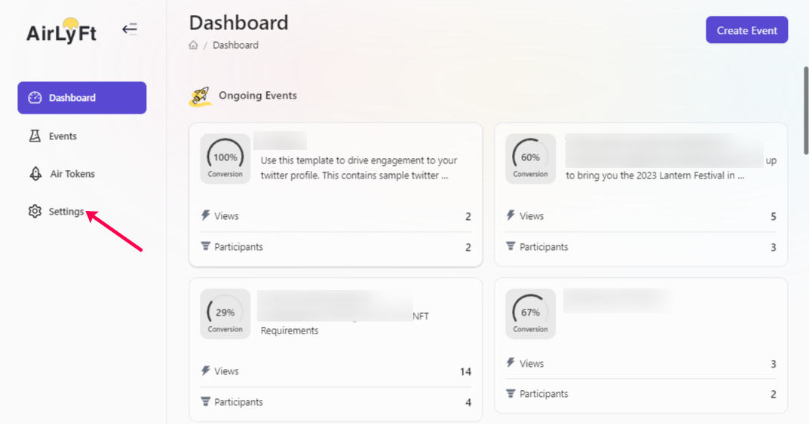
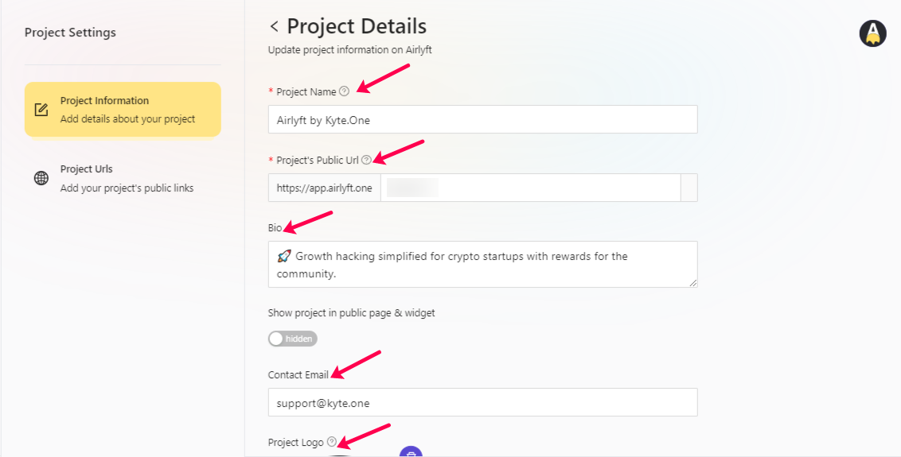
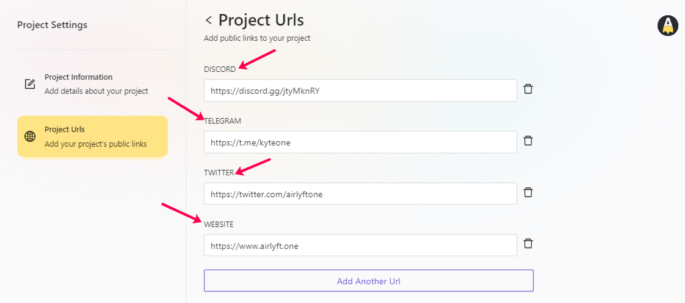

# Project Setting

Every single project on AirLyft is required to fill up certain project details that users can view on the project page. Now, it is possible that your social detail changes over time or you probably rename your project name or so. With all those cases into consideration, AirLyft gives you the flexibility to edit your project information. Let's take a deep look at how to make edits to the project settings.

- Login to AirLyft and once you are on the dashboard, please click on the settings button as shown in the screenshot below. 

- You will now be redirected to the Project Settings page where you will be provided with Project Information and Project URLs. If you are looking forward to editing your Project Name, Project Public URL on AirLyft, Project Bio, Email, Logo, and Banner, you can do so directly in the Project Information section as shown below. 

- Next, if you want to change or add project URLs on the public page, please click on the Project URL section and make edits accordingly. 

- If you want to add any other URL, say whitepaper or tokenomics, that you want your participants to view on your public page, you can do so by clicking on Add Another URL button. 

And that's it ... Your Project settings are configured per your latest requirements. 

:::tip For instant help

1. Email us at support@kyte.one
2. Join [this Telegram group](https://t.me/kyteone): https://t.me/kyteone

:::