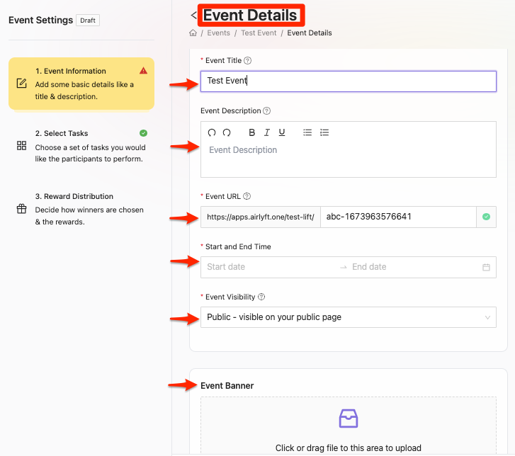
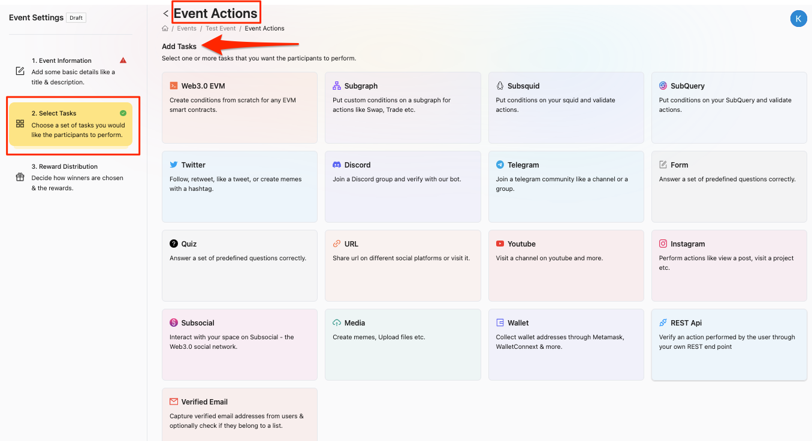
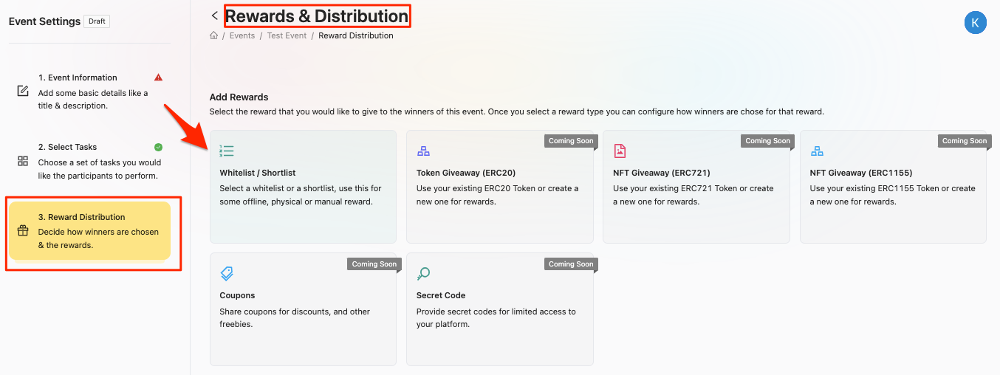
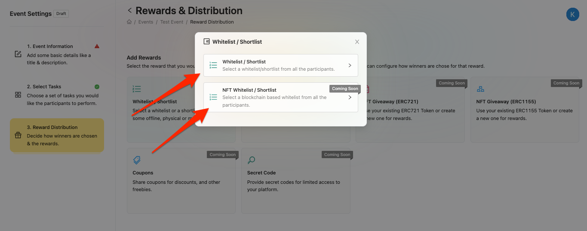
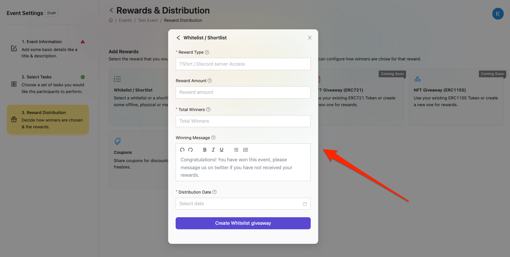

# Whitelist/Shortlist Reward
AirLyft now supports Whitelist Campaigns as well. Create your campaigns in simple steps and shortlist your campaign winners as per your criteria. Please follow the steps below on how to conduct a Whitelist Reward Giveaway.

## What is a whitelist/shortlist?
A "whitelist" or a "shortlist" means that you (the event host) will get a list of winners from the event and you can use that list in any way you please.
## When to use a whitelist/shortlist?
Usually, a whitelist/shortlist reward is used for instances where you cannot use AirLyft to distribute the reward. For example:
- You are launching an NFT project and want to capture early community members or supporters.
- The reward is some merchandise that you will manually send to the winners.
- You want to create an event for a beta product access, discount, pre-launch offers etc.

## How to create a whitelist?
1. Fill out all your event details on the first page then move onto the task selection page.

2. Once there, select all the tasks you want to keep in your campaign for your community and then move onto the reward selection page.

3. Once here, make your reward type selection by clicking on the Whitelist/Shortlist button.

4. Once clicked, this will show you 2 options, one is Whitelist/Shortlist & the other is NFT Whitelist/Shortlist. Click your reward choince and the it will take you to the final page.

5. Once at the final page, fill in all the details starting from reward type, reward amount, total winners, customize your congratulatory message as per your liking, and then finally the distribution date of the campaign rewards.
Note that from AirLyft, you will receive a list of winners, what the winners will actually receive depends upon you.
- *Reward Type*: This means what would be the FINAL reward like Tshirts, or access to some NFT project etc.
- *Reward Amount*: How many rewards will each winner receive? If each winner will win 1 tshirt, then enter '1' here.
- *Total Winners*: What will be the number of winners total winners.
- *Winning Message*: This will be the message that the winners will see.
- *Distribution Date*: When will they receive this reward?

If you are facing any issues with Reward Selection, please drop a line at support@kyte.one !