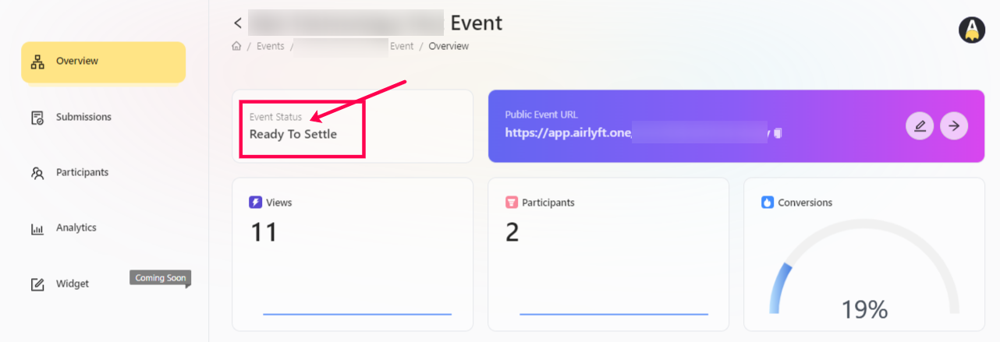
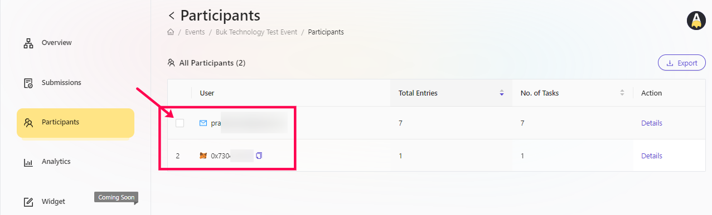

# Settle Manual Whitelist Events

Once the event is completed or the end date of the event is approached, AirLyft no longers allow participation in the event and ultimately the status of the event turns to a "Ready To Settle" state. In this state, it is expected for projects to manually select winners from the list of participants. Let's take a look at how to manually select the winners and then settle the completed event.

- Login to AirLyft and once you are on the dashboard, please click on the events tab as shown in the screenshot below.

- After you are on the event page, select the corresponding event for which you want to check the participant data and click on the View button. 

- You are now on the event overview page. If you look closely at the event status here, you can see the status as "Ready To Settle".

- Next step is to click on the Participants tab where you can see all data of your participants is available on a single page. 

- On the participant's page, based on whom you want to shortlist, hover on that specific row and you will be provided with a checkbox to select that particular entry.  

- Once you select all the winners, at the bottom right corner of the screen, you will be provided with a Finish & Submit button that you will have to click and that's it. You have now manually shortlisted the required users and the next time they log in on the event link, they would be shown as Shortlisted.

> **NOTE:** Please be informed that you can't revert the shortlist status and it is a one-time activity for any "Ready To Settle" event.

:::tip For instant help
1. Email us at support@kyte.one
2. Join [this Telegram group](https://t.me/kyteone): https://t.me/kyteone
:::