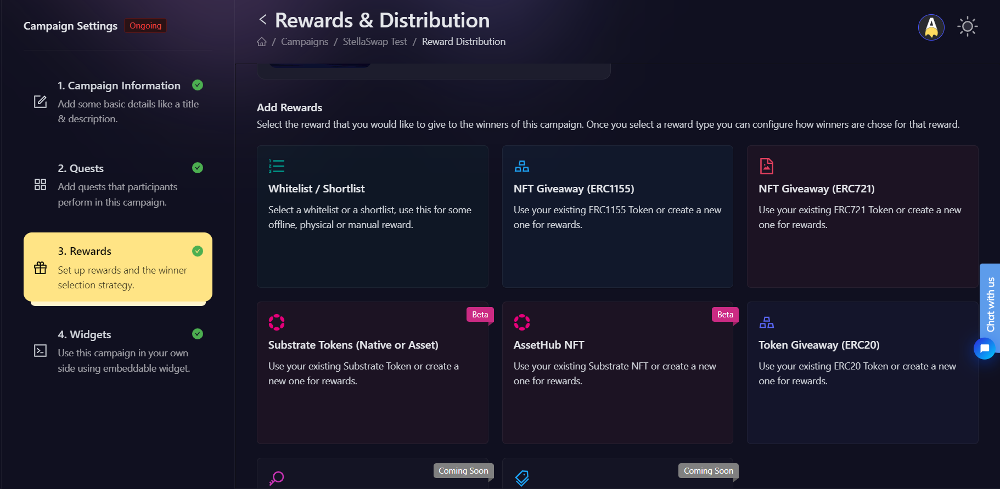
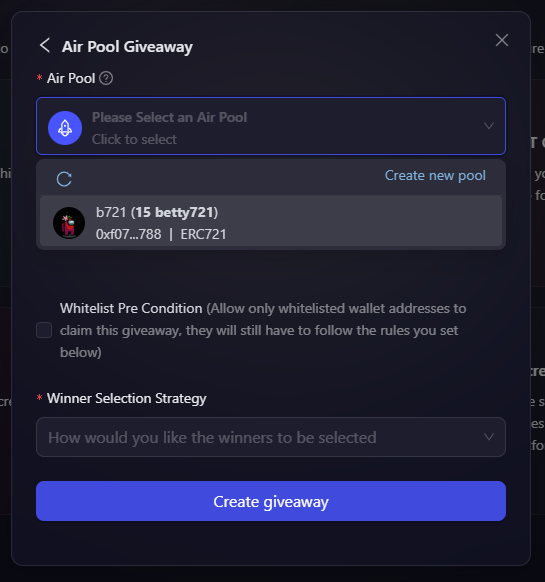
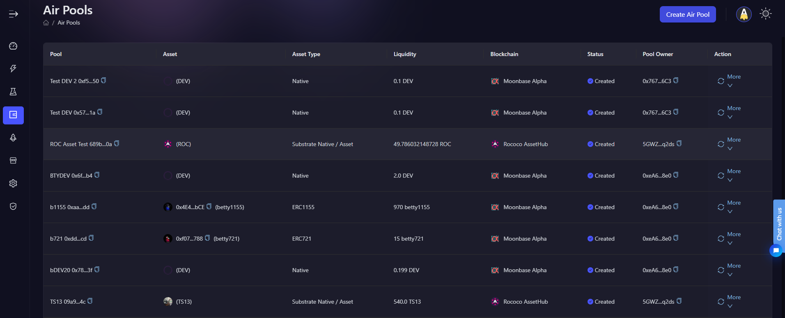
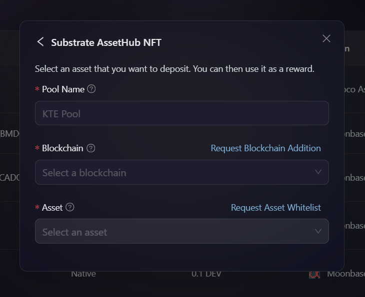
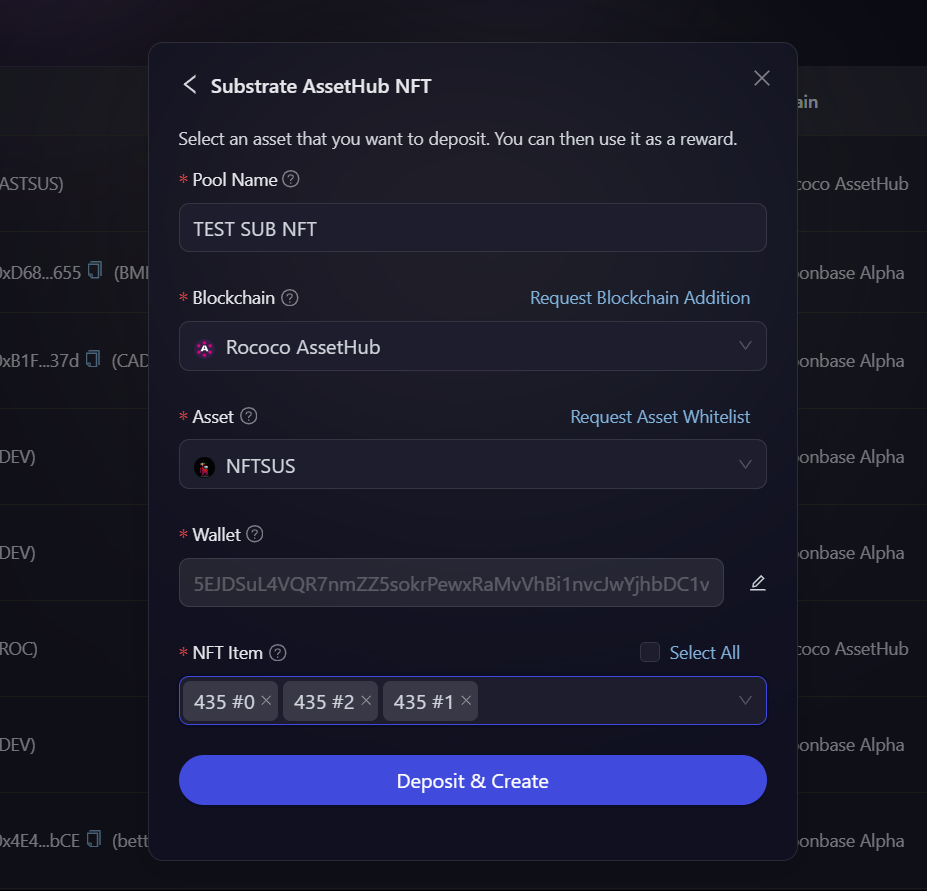

# Creating Substrate AssetHub NFT AirPool

This article focuses on how to create your first Substrate AssetHub NFT reward pool on AirLyft.

There are two ways to create Substrate AssetHub NFT AirPool. You can either create them from the AirPool tab, or you can click on **Create New Pool** while adding a reward to your campaign.

## Create a Pool within campaign

- In order to create AirPool from the Rewards, go to the Rewards tab under your campaign, and choose AssetHub NFT and then choose AirPool Giveaway.

    

- Click on the **Select an AirPool** dropdown, and click on **Create New Pool**.

    

## Create a Pool through AirPools page

- You can also go to the AirPool page where you can find your existing Pools or create a new one. Lets create a new AirPool by clicking on the Create AirPool button available on top right corner of the screen.

    

- A new window pops up asking you to select the type of AirPool you want to create. Select Substrate AssetHub NFT from the list of options.

- You will now be provided with few options to fill about the reward pool that you want to create such as Pool Name, Blockchain, and Asset.

    

- In case you don't see your blockchain or asset available on the list, you can find the [Request Blockchain Addition](https://docs.google.com/forms/d/e/1FAIpQLScGG6eDTSPhpbfsdiQ9H6vlzZdBDwP4u_phpMyb5zh-D-de4A/viewform) or [Request Asset Whitelist](https://docs.google.com/forms/d/e/1FAIpQLSdmdE3BmNwWQ1kZbKZqFzzRoBX38ltecXiSjuS5VEthwH28Yw/viewform) options. Click on it and fill up the short form for us to manually add the blockchain or asset to the list. You can contact our support on [support@airlyft.freshdesk.com](mailto:support@airlyft.freshdesk.com) for a faster resolution.

- After you select your asset, choose the wallet you'd like to use for the transaction. Then click on **Fetch Accounts**. Then select the account you'd like to use, and then click on **Get NFTs**.

- After your NFTs are fetched from the account, choose the NFTs you'd like to lock in the pool, if you want to use all the NFTs, check the **Select all** checkbox.

- Then, click on **Deposit & Create**, then sign the transaction and allow some time for the transaction to be included in the block until the transaction is completed.

    

- Wohoo... Your first Substrate AssetHub NFT reward pool on AirLyft is now successfully created. You can now see your created reward pool along with pool id, transaction id, and other details on the AirPool page.

:::tip For instant help
1. Email us at [support@airlyft.freshdesk.com](mailto:support@airlyft.freshdesk.com)
2. Join our official [Telegram group](https://t.me/kyteone)
::: 