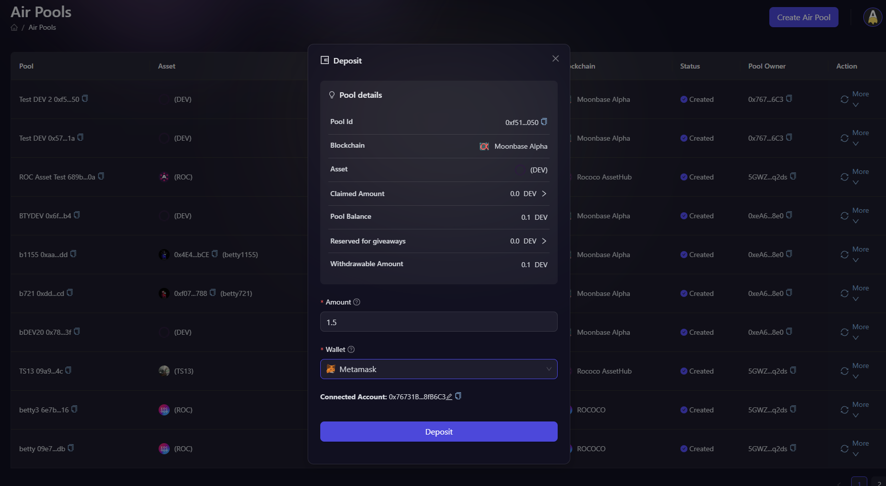
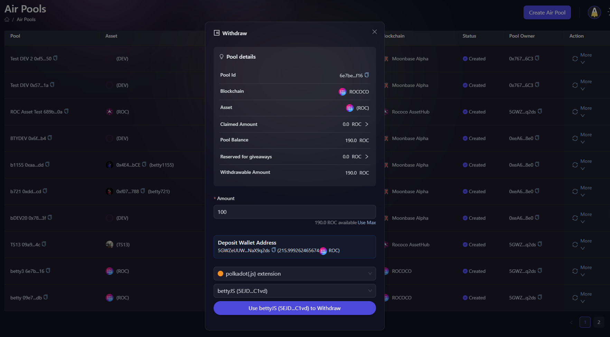

# Deposit & Withdraw: AirPool

It is possible that the marketing strategies change last minute and projects might need to either deposit more funds into the reward pool created at AirLyft or withdraw some funds from the reward pool created. At AirLyft, you can successfully do so. Please follow the steps below on how to initiate a deposit or withdraw of funds from the AirPool. 

## Deposit

- In order to deposit more funds to your existing AirPool, select the pool on which you would like to add funds and then click on the More option against that pool. 

- Next, deposit box opens up in which you can view the already existing pool details and below, it would ask you to enter the amount you want to deposit more along with selection of wallet from which you would be adding the funds.

- Click on deposit and voila, you have successfully added funds to your AirPool reward pool.

## Withdraw

- To withdraw from created reward pool, select the pool on which you would like to add funds and then click on the More option against that pool and select Withdraw from the drop-down list.

- Next, withdraw box opens up in which you can view the already existing pool details and below, it would ask you to enter the amount you want to withdraw along with selection of wallet on which you would be withdrawing the funds. Once selected, click on Withdraw button as shown in screenshot below.

- And voila, your funds have been successfully withdrawn to your source account. 

:::tip For instant help
1. Email us at support@kyte.one
2. Join our official [Telegram group](https://t.me/kyteone)
::: 