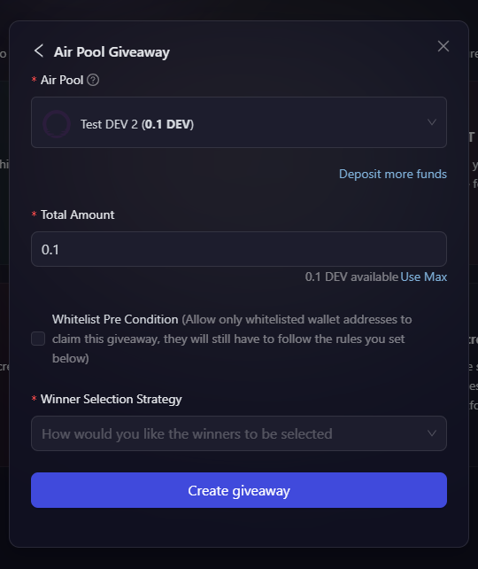

# Using Created AirPool

Now that you have your ERC 20, ERC 721, ERC 1155 AirPools created, the next step is to understand on how can we use the created reward pools at AirLyft. Let's dive deep into the details.

- Go to the Rewards Tab under your campaign.

    

- On the reward distribution page, you will find the types of Rewards you can add to your campaign. Now, if you want to distribute the created AirPool, you can use the NFT Giveaway or AssetHub NFT blocks. Let's take Token Giveaway(ERC20) as example:

- Click on the Token Giveaway (ERC20) and a popup window appears asking you to choose your selection between AirToken & AirPool. Click on the AirPool option here. 

    

- After you click on AirPool Giveaway option, you will have the option to select the created AirPool. If you haven't created it yet, click on the create new pool option to create your own AirPool reward. 

    

- Please also note that you can use the deposit more fund option here to add more liquidity to your reward pool. 

- Let's select the already created pool which shows we have a reward pool with name of "**Test DEV 2**" that has the **liquidity available of 0.1 DEV**. Now, as the liquidity is only 0.1 DEV, you can write 0.1 in the Total Amount field.

    

- Then select the [Winner Selection Strategy](../campaign/rewards/winner-selection/index.md) you'd like to use for the reward. You can then set the task rules depending upon the chosen strategy. Click [here](../campaign/rewards/winner-selection/index.md) to learn about them in detail.

- If you only want to allow whitelisted wallet addresses to claim the reward, then check the **Whitelist Pre Condition** checkbox, and then upload a CSV file containing the whitelisted wallet addresses.

    

- Finally click on Create Giveaway button to add the Reward to your campaign.

> **Note:** You can select any type of giveway module from the Reward Distribution page and then publish your event rewards. The same steps will have to be followed for ERC1155, Substrate Tokens, and AssetHub NFT modules too.

:::tip For instant help
1. Email us at support@kyte.one
2. Join our official [Telegram group](https://t.me/kyteone)
:::

