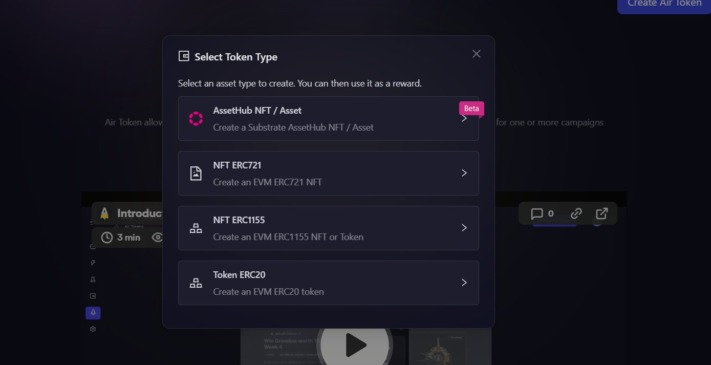
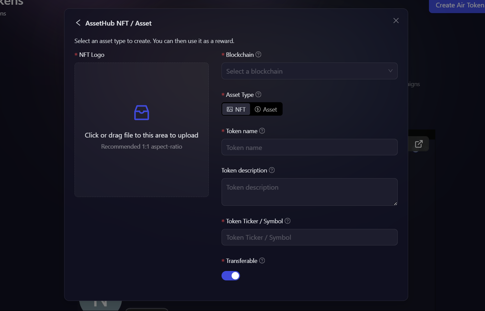
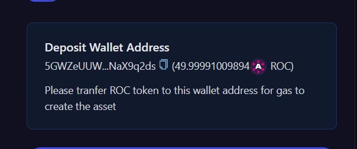

# Create AssetHub NFT / Asset

This article focuses on how to create your first AssetHub NFT / Asset on AirLyft.

1. Click on the AirToken Icon to got the AirToken tab.

2. Next, you will be on the AirToken page where you can find your existing tokens or create a new one. Lets create a new AirToken by clicking on the Create AirToken button available on top right corner of the screen.

3. A new window pops up asking you to select the type of AirToken you want to create. Select AssetHub NFT / Token from the list of options.

4. Next, you will now need to enter the AssetHub NFT details such as:
    - The blockchain on which you want to deploy
    - Asset Type (NFT or Asset)
    - Token Name
    - Token Description
    - Token Ticker/Symbol
    - Whether to make the token soul bound or transferable

5. After you select the blockchain, you'll get a wallet address, you'll need to deposit some tokens to that address to pay for the gas.

6. After filling in all the details and transferring tokens to the given wallet address, click on **Create** button to create your NFT/Asset.

:::tip For instant help
1. Email us at support@kyte.one
2. Join our official [Telegram group](https://t.me/kyteone)
:::