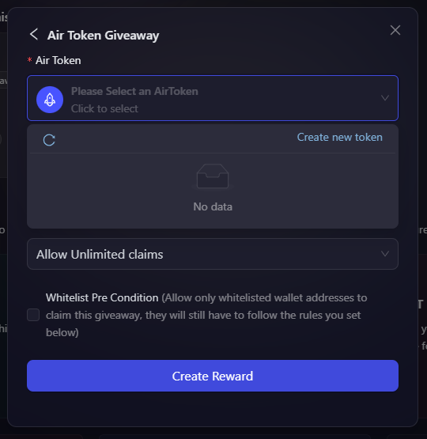
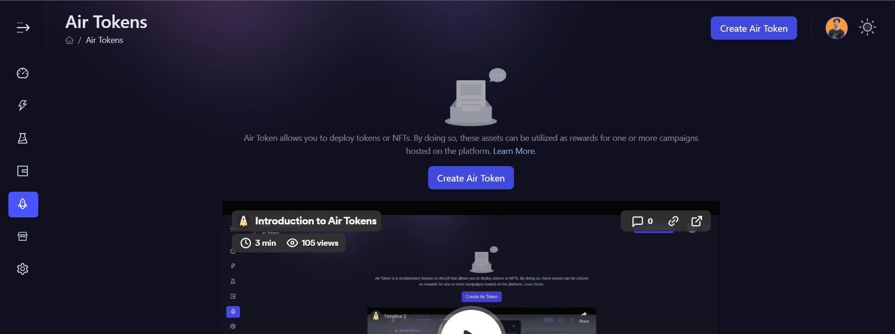
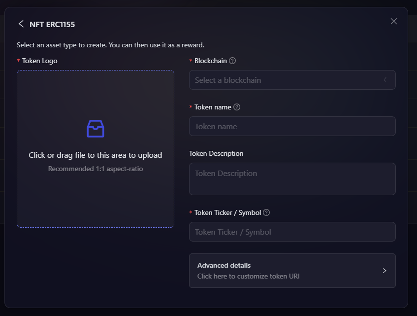
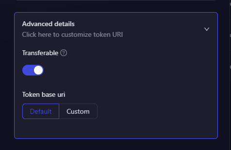
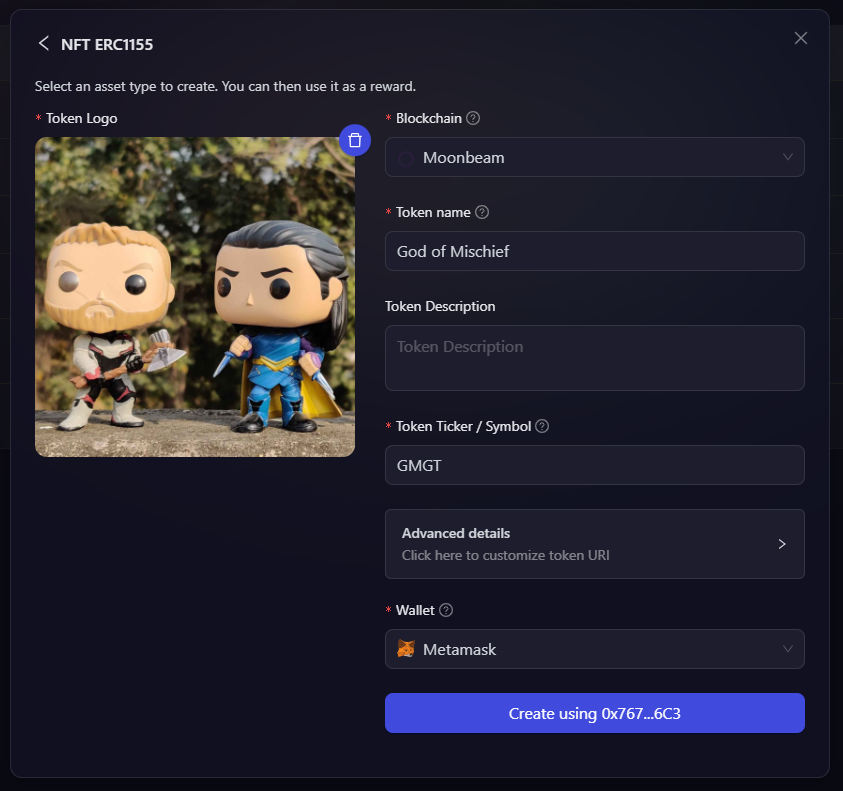

# Create ERC 1155 AirTokens

This article focuses on how to create your ERC 1155 AirToken on AirLyft.

There are two ways to create ERC 1155 AirToken. You can either create them from the AirToken tab, or you can click on **Create New Token** while adding a reward to your campaign.

## Create a Token within campaign

- In order to create AirToken from the Rewards, go to the Rewards tab under your campaign, and choose NFT Giveaway(ERC1155) and then choose AirToken Giveaway.

    

- Click on the **Select an AirToken** dropdown, and click on **Create New Token**.

    

## Create a Token through AirTokens page

- You can also go to the AirToken page where you can find your existing tokens or create a new one. Lets create a new AirToken by clicking on the Create AirToken button available on top right corner of the screen.

    

- A new window pops up asking you to select the type of AirToken you want to create. Select NFT ERC1155 from the list of options.

- Next, you will now need to enter the ERC 1155 NFT details such as the blockchain on which you want to deploy, token name, token ticker, and token description. You will need to upload the image of NFT which is in 1:1 aspect ratio which will be the image content deployed on the blockchain. 

    

- Under Advanced Details, you can set token to be soul bound or transferable, and set a custom token base URI. 
    
    

- Once you have all the details uploaded, you will now find the option to create token on selected blockchain by paying a minimal network gas fees. 
  
    
  
- Carry out the actions on decentralized wallet by signing the transaction, paying the gas fees, and Woohoo your ERC 1155 AirToken has been created successfully on the selected network. You can now check them on NFT marketplaces supported by the selected blockchain.

:::tip For instant help
1. Email us at [support@airlyft.freshdesk.com](mailto:support@airlyft.freshdesk.com)
2. Join our official [Telegram group](https://t.me/kyteone)
:::