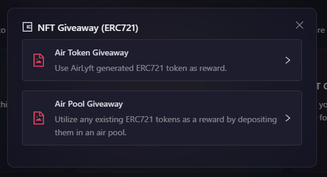

# Using Created AirToken

Now that you have your AirToken created, the next step is to understand on how can we use the created AirTokens for a campaign at AirLyft. Let's dive deep into the details.

- Go to the Rewards Tab under your campaign.

    

- On the reward distribution page, you will find the types of Rewards you can add to your campaign. Now, if you want to distribute the created AirToken, you can use the NFT Giveaway or AssetHub NFT blocks. Let's take NFT Giveaway(ERC721) as example:

- Click on the NFT Giveaway (ERC721) and a popup window appears asking you to choose your selection between AirToken & AirPool. Click on the AirToken option here.
  
    

- After you click on ERC 721 Giveaway option, you will have the option to select the created AirToken you want to use as reward or if you haven't created it yet, click on the create new token option to create your own AirToken.

    

- Then select the [Winner Selection Strategy](../campaign/rewards/winner-selection/index.md) you'd like to use for the reward. You can then set the task rules depending upon the chosen strategy. Click [here](../campaign/rewards/winner-selection/index.md) to learn about them in detail.

- You can also set if the claims are capped or uncapped. If you select it as Capped, you can set the number of created AirToken NFTs that can be claimed, and if you select it as Allow Unlimited Claims, participants can claim NFTs unless the event ends.

- If you only want to allow whitelisted wallet addresses to claim the reward, then check the **Whitelist Pre Condition** checkbox, and then upload a CSV file containing the whitelisted wallet addresses.

    

- Finally click on Create Giveaway button to add the Reward to your campaign. 

> **Note:** You can select any type of giveway module from the Reward Distribution page and then publish your event rewards. The same steps will have to be followed for ERC1155, Substrate Tokens, and AssetHub NFT modules too.

:::tip For instant help
1. Email us at [support@airlyft.freshdesk.com](mailto:support@airlyft.freshdesk.com)
2. Join our official [Telegram group](https://t.me/kyteone)
:::