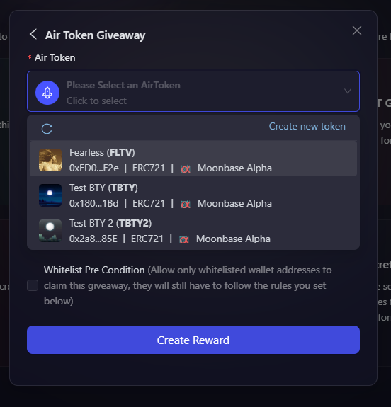

# Using Created AirToken

Now that you have your ERC 721 abd ERC 1155 AirToken created, the next step is to understand on how can we use the created AirTokens for a campaign at AirLyft. Let's dive deep into the details.

- Firstly, login to your AirLyft account with which you have signed in earlier and go to your dashboard. 

- Next, headover to top right part of your screen where you can see the button "Create Event". Click on the button as shown in screenshot below.

    

- Next, fill up the basic details and then creation actions on the select apps tab. While these are self explanatory, however, you can still refer to the event creation and task creation documents here for a much better understanding. 

- Once your details are filled and tasks have been created, the last step is to create your reward distribution strategy. Just so that we are on the same page, here is a screenshot showing the reward distribution page. 

    

- On the reward distribution page, you will be provided with multiple reward modules which is Whitelist, NFT Giveaway (ERC 721), NFT Giveaway (ERC 1155), Token Giveaway (ERC 20), Coupons, and secret codes. Now, if you want to distribute create NFT rewards on-chain, you can use the NFT giveaway blocks. Let's say for the sake of document, we want to do a ERC 721 NFT giveaway.

- Click on the NFT Giveaway (ERC721) and a popup window appears asking you to choose your selection between AirToken & AirPool. Click on the AirToken option here.
  
    

- After you click on ERC 721 Giveaway option, you will have the option to first select the blockchain on which you have created AirToken earlier. Once the blockchain is selected, you can see earlier created AirToken on this blockchain or if you haven't created it yet, click on the create new token option to create your own AirToken.

    

- Next, you will need to set if the claims are capped or uncapped. If you select it as Capped, you can set the number of created AirToken NFTs that can be claimed on-chain and if you select it as Allow Unlimited Claims, participants can claim NFTs unless the event ends. 

    

- You can also set your distribution strategy. Currently we only have 2 distribution strategies available which is **Specific Task Based FCFS with instant claim** & **First Come First Serve with Instant Claim**. In both the distribution strategies, you can set up rules as to what all tasks needs to be completed so that participants will be eligible to claim the NFT on-chain. In the below screenshot, you can see where to select tasks and how many NFTs they can claim.

    

- Finally click on Create Giveaway button, followed by Publish, and woohoo your first AirToken NFT Giveaway has now been successfully created. 

> Note: ***You can select any type of giveway module from the Reward Distribution page and then publish your event rewards. The same steps will have to be followed for ERC1155 modules too. ***

:::tip For instant help
1. Email us at support@kyte.one
2. Join our official [Telegram group](https://t.me/kyteone)
:::