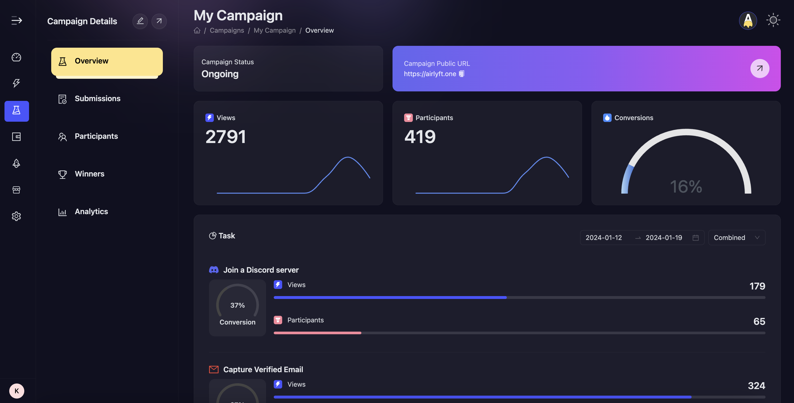

# Analytics

AirLyft provides its projects the flexibility to track their campaign performance. After a campaign has been published there are two pages from where you can view analytics:

1. Overview
2. Analytics

:::note Data Discrepancy

AirLyft analytics can sometimes show data that is slightly different from participants, this usually happens as the analytics system gets blocked by adblockers & such. The Analytics system is provided to give an overall approximate picture, for a deep dive into participation and correct data visit the [Participations](./participation-view) or [Submissions](./submission-view) tabs instead of Analytics.

:::

AirLyft provides projects the flexibility to check the overall view of an event which includes below details.

1. Public Event URL
2. Number of Views
3. Number of Participants
4. Conversion Percentage
5. Task Level Conversion Percentage

We have very strategically placed the above parameters in a single view as it gives a greater picture of your campaign performance. Some of the insights you can receive are

- How many users have viewed your event but may or may not have participated i.e. VIEWS
- How many users have participated in your event i.e. PARTICIPANTS
- Based on views and participants, what are overall conversion rate of users landing on your campaign i.e CONVERSION
- With number of tasks available, what percentage of users have viewed and what percentage of users have participated to complete a specific task i.e. TASK LEVEL CONVERSION

These parameters we understand are very important when you conclude the performance of the campaign and based on the numbers achieved, you can strategically design your future campaign in a way that can provide a greater conversion rates.

:::tip For instant help

1. Create a support ticket on our Discord: https://discord.gg/bx6ZCTwbYw
2. Join [this Telegram group](https://t.me/kyteone): https://t.me/kyteone

**_The AirLyft Team is there to help you. AirLyft is a platform to run marketing events, campaigns, quests and automatically distribute NFTs or Tokens as rewards._**

:::