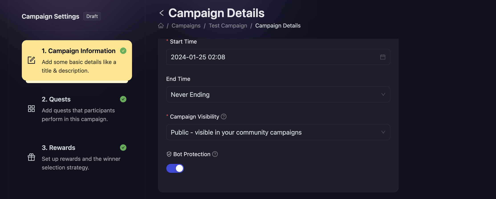
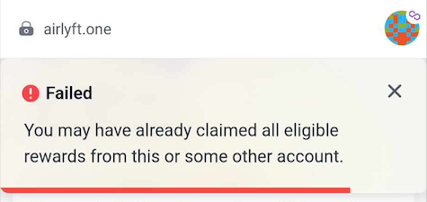

# Bot Protection

- When creating your campaign, there is an option to enable "Bot Protection". By enabling this option, AirLyft switches on all it's anti-bot mechanisms for your campaign. This option needs to be switched on for every campaign individually.

  

## 1. While Participating

1. In any case, AirLyft will only allow a single account (like wallet address or twitter) to participate in a quest only once.
1. When Bot Protection is enabled, AirLyft also ensures that users from the same IP are not able to participate in the same quest repeatedly.

## 2. While Claiming Rewards

1. In any case, AirLyft will only allow a single wallet to claim a reward once.
1. With Bot Protection, AirLyft also only ensures that a single IP can claim a reward only once.
1. With Bot Protection, AirLyft also shows a captcha that the participants have to solve right before claiming the reward.

- When AirLyft detects a suspicious activity on claiming the reward, an error message similar to this pops up and claim is rejected:

  

AirLyft makes a best-effort to stop Bots from participating in your campaigns but as you might understand that it is a continuous battle to keep your giveaways safe & we do not provide gaurantees on the same. Please read our [terms and conditions](https://airlyft.one/launch/terms) for further details.

:::tip For instant help

1. Create a support ticket on our Discord: https://discord.gg/bx6ZCTwbYw
2. Join [this Telegram group](https://t.me/kyteone): https://t.me/kyteone

**_The AirLyft Team is there to help you. AirLyft is a platform to run marketing events, campaigns, quests and automatically distribute NFTs or Tokens as rewards._**

:::
