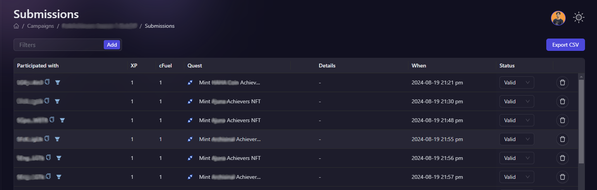
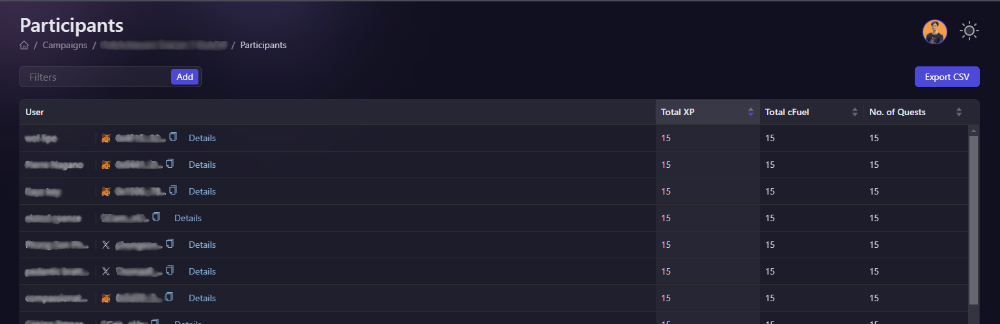

# Export Data

AirLyft provides a unified view of your event participations so that projects can conclude strategies based on the data sets available infront of them. You can simply export all the data in a single CSV file and action on it based on your requirements. Let's take a deep look on how to export the event results in a single click.

There are two types of data export available at AirLyft, as mentioned below. 

- **Submission Data Export**  
- **Participant Data Export**

### Submissions Data Export

Let's first understand on submission data export. AirLyft provides projects with submission data in which you can view task level breakdown of user participations, the number of entries they scored for that particular task, the status of their entry and other things. To get an indepth understanding of submission data, please refer to the link here. 

On the submission page, simply click on the export button as shown in the screenshot below and that's it!!! Your event submission data has been downloaded successfully to your local system.

### Participants Data

Next is the participant data which provides projects with an overall view of the number of entries a particular user has scored, the number of tasks they have completed, and also provide a link to check on what actions have they performed as a part of this event. To get an indepth understanding of participant data, please refer to the link here. 

On the participant page, simply click on the export button as shown in the screenshot below and that's it!!! Your event participation data has been downloaded successfully to your local system.

:::tip For instant help

1. Create a support ticket on our Discord: https://discord.gg/bx6ZCTwbYw
2. Join [this Telegram group](https://t.me/kyteone): https://t.me/kyteone

**_The AirLyft Team is there to help you. AirLyft is a platform to run marketing events, campaigns, quests and automatically distribute NFTs or Tokens as rewards._**

:::