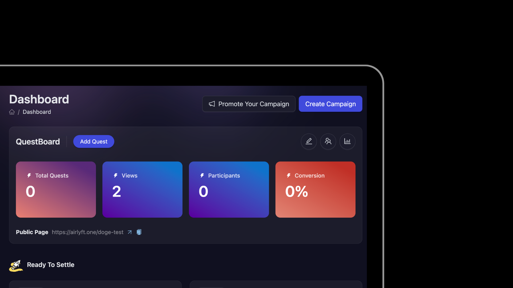
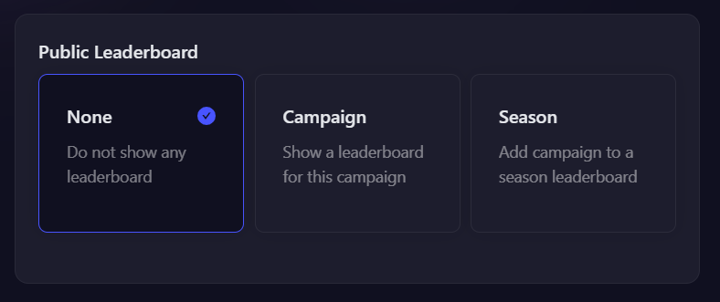
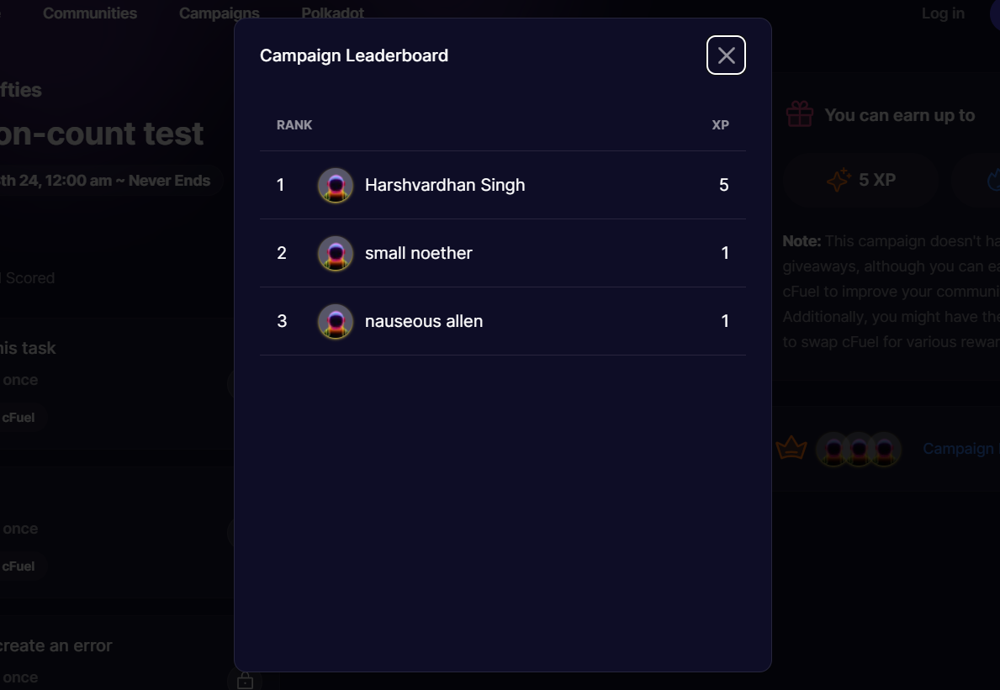

# Campaign

A Campaign is, usually a time bound, group of quests that you can setup for your community. You can run any number of campaigns & every campaign can have it's own quests, rewards, start/end time, as well as leaderboard among other things.

## Creating a Campaign

This tutorial focuses on how to create and update the campaign in AirLyft.

1. Firstly, login to your AirLyft account with which you have signed in earlier and go to your [dashboard](https://account.airlyft.one/).
2. Next, headover to top right part of your screen where you can see the button "Create Campaign". Click on the button as shown in screenshot below.

   

3. Upon clicking the button, you will get a list of options like "Create from Scratch" or select from a range of templates. Click on "Create from Scratch" or chose a template. To see the templates in live action click [here](https://docs.airlyft.one/templates/).
4. In the pop up, please enter campaign name and click on Save and Continue button.
5. On the Campaign details page, you can add the campaign description, start date, end date, campaign banner. You will see that the campaign link will be automatically be filled but you can change that. For the campaign link only special characters like - and \_ are allowed.

### Campaign Visibility

On the Campaign details page, the **"Campaign Visibility"** option allows you to ensure that your campaign appiers in your project page in the AirLyft App section

- If you select "Public - Visible in your public page" and only the users with the link can access the page
- If you select "Private - only people with the link can access the campaign page". The Public option is selected by default.
- The "Public Explorable" Visibility allows the campaign to be visible to all AirLyft users even outside your community. This visibility cannot be set from here, instead when you "Public and Announce" your campaign it is automatically set by AirLyft after some basic verification.

### Leaderboard & Seasons

Every campaign can have it's own leaderboard which takes into consideration the XP scored by the user. Hosts can decide the type of leaderboard that is shown in a campaign.

- Note: These leaderboards are different from the community level leaderboards.

  

#### None

If 'none' is selected, then the campaign will not show any leaderboard.

#### Campaign

If a 'campaign' level leaderboard is selected, then a leaderboard is shown within the campaign that ranks users based on the XP they have scored within that campaign only.

#### Season

Seasons are a great way to club leaderboards of two or more campaigns. In case a season leaderboard is selected, the host needs to provide a Season name to the campaign. This same season name can be used in any number of campaigns as required and the leaderboard will show ranks of users based on the XP scored by the users in all these campaigns together.

For example:

- Campaign 1 has "Season 1"
- Campaign 2 has "Season 2"
- Campaign 3 has "Season 1"

In this case:

- Campaign 1 & 3 will show the exact same leaderboard i.e. "Season 1 Leaderboard", ranks of the users will be determined by adding the XP they have scored in Campaign 1 and 3.
- And Campaign 2 will have a different leaderboard.

:::tip For instant help

1. Create a support ticket on our Discord: https://discord.gg/bx6ZCTwbYw
2. Join [this Telegram group](https://t.me/kyteone): https://t.me/kyteone

**_The AirLyft Team is there to help you. AirLyft is a platform to run marketing events, campaigns, quests and automatically distribute NFTs or Tokens as rewards._**

:::
