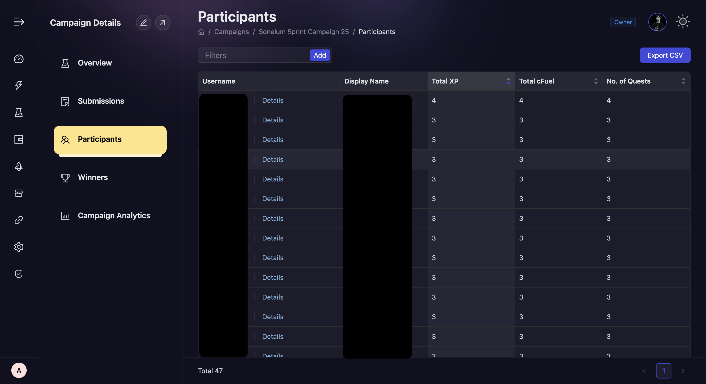

# Participants

AirLyft provides projects the flexibility to view participant-wise data at any point during a campaign. You can check the number of the quests a particular user has done, their total fuel & XP, and drill down into the quests have they performed as a part of this campaign. Let's take a deep look at where can we view the participant list.

- Open the [Campaigns page (https://account.airlyft.one/campaigns)](https://account.airlyft.one/campaigns)

1. In the "Action" column select
2. Hover on "More"
3. And then select "Participants"

- The Participant view provides a overall view of users who have participated in the campaign. You can also view what are the cFuel/XP a particular user has been rewarded and how many tasks have they completed.

  

- Alternatively, if you want to check for what all tasks has a particular user completed, you can simply click on the **Details** option specific to that user and check the drill down of different actions performed by them on this event.

- You can also filter participants based on specific quests performed and participation date range.

- You can also use [**"Export CSV"**](./export-data#submissions-data-export) to get all the participation data in a CSV for further analysis.

:::tip For instant help

1. Create a support ticket on our Discord: https://discord.gg/bx6ZCTwbYw
2. Join [this Telegram group](https://t.me/kyteone): https://t.me/kyteone

**_The AirLyft Team is there to help you. AirLyft is a platform to run marketing events, campaigns, quests and automatically distribute NFTs or Tokens as rewards._**

:::
