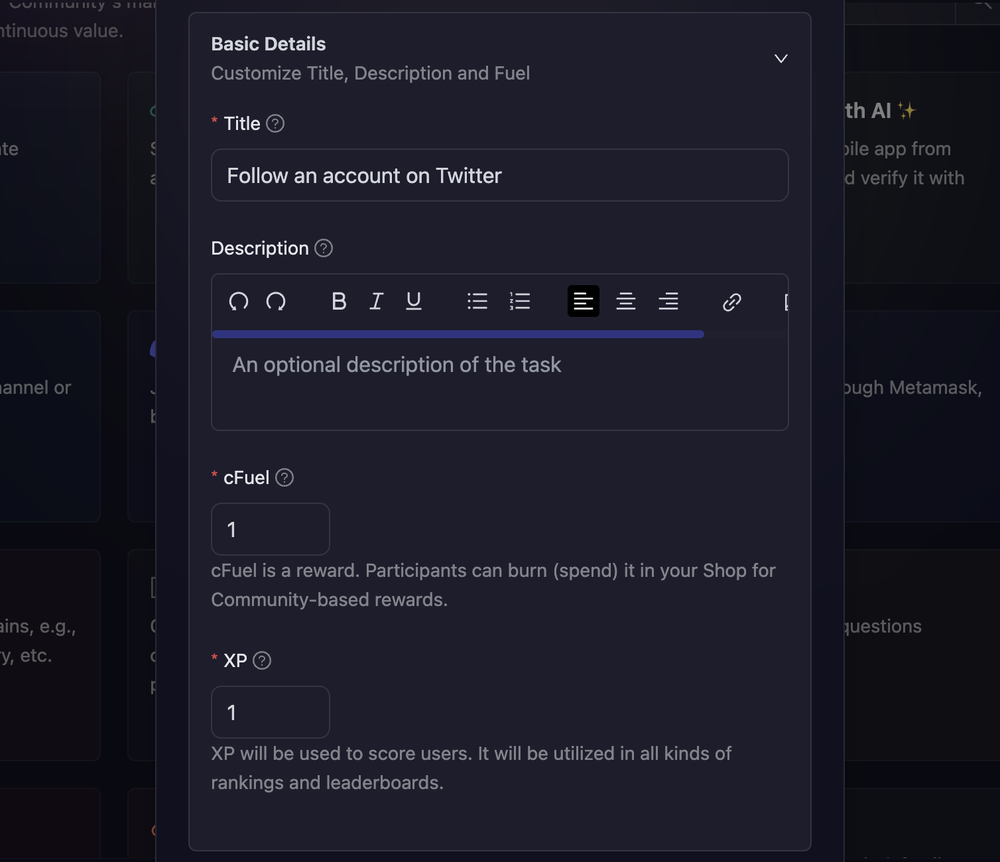
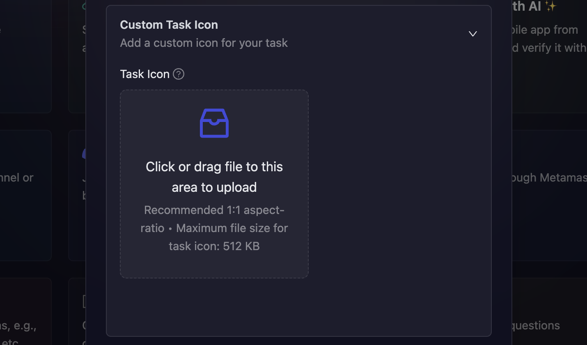

# Quest Basic Details and Icon

When creating any quest task in AirLyft, you'll need to provide basic details for the task. You can also add a custom icon to your tasks. This section explains how to configure these fundamental settings.

## Setting Up Basic Details

Click on the **Basic Details** option to expand the configuration section where you can enter the essential information for your quest task.

### Required Fields

When setting up the basic details, you'll need to provide:

- **Title**: A clear and descriptive name for your quest task
- **Description**: Detailed explanation of what participants need to do to complete the task
- **cFuel/XP**: The reward points participants will earn upon successful completion. To learn more about XP and cFuel, please refer to the [XP and Fuel](./xp-fuel.md) guide.

### Custom Task Icon

You can also add custom icons to your tasks.

### Best Practices

- **Elaborate on the title and description** so that participants have a much greater understanding of the task
- Use clear, action-oriented language that explains exactly what users need to do
- Set appropriate reward values that match the difficulty and importance of the task
- Consider your overall campaign strategy when setting reward amounts

## Next Steps

After configuring the basic details, you can:

1. Configure **[Task Condition & Recurrence](task-condition-and-recurrence.md)** settings
2. Set up task-specific configurations based on the quest type you're creating
3. Add the task to your campaign

:::tip For instant help

1. Create a support ticket on our Discord: https://discord.gg/bx6ZCTwbYw
2. Join [this Telegram group](https://t.me/kyteone): https://t.me/kyteone

**_The AirLyft Team is there to help you. AirLyft is a platform to run marketing events, campaigns, quests and automatically distribute NFTs or Tokens as rewards._**

:::
