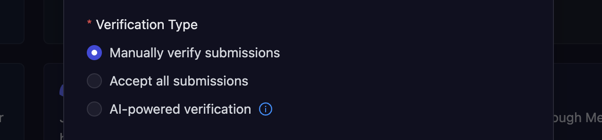
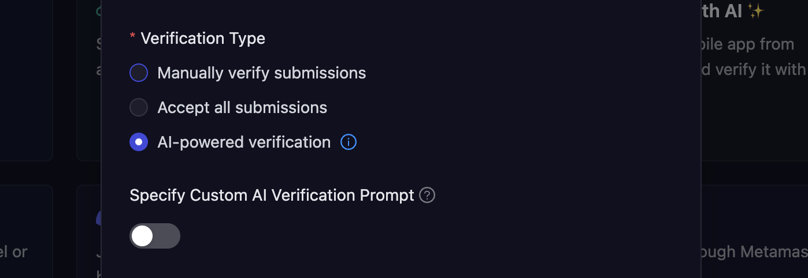
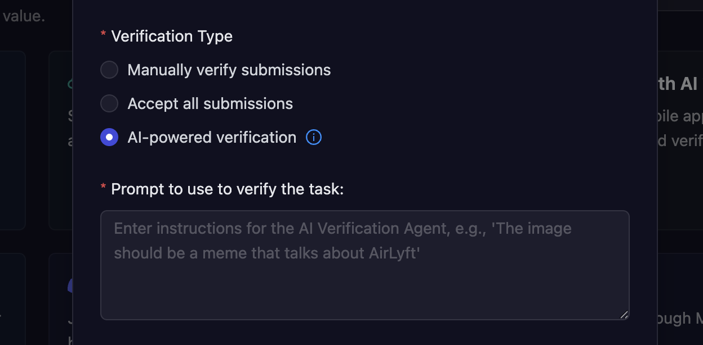

# Quest Verification Type

AirLyft automatically verifies tasks performed by participants, but for some tasks, you can select the type of verification you want. AirLyft offers three type of verification methods for tasks. These are as follows:

- [Manual Verification](#manual-verification)
- [Automatic Verification](#automatic-verification)
- [AI Powered Verification](#ai-powered-verification)

  

### Manual Verification

As the name suggests, this verification methods allows a community owner or a reviewer to manually go through the user submissions, and marked them as valid or invalid. This might be useful for when you want to manually go through and verify the details of tasks performed by users.

### Automatic Verification

In this type of verification method, all the submissions made by users are marked as valid.

### AI Powered Verification

AirLyft's **AI Agentic Verification** enables projects to automate the verification of user submissions. This powerful feature helps ensure content authenticity and saves 100+ hours for marketing and community teams.

Instead of manually going through each submission, you can configure AI-powered rules to automatically verify the content and award points only when it meets the campaign criteria. This prevents irrelevant or fake submissions (like blank screenshots or gibberish text) from being accepted.

- For some tasks (like Forms, Mobile App Install, etc.) you can either use the default prompt or give a custom prompt based on your requirements to verify the submissions.

- While some tasks (like Tweet, Media Upload, etc.) require you to enter a prompt for AI verification.

> 💡 **The better your prompt, the more accurate the AI's verification will be.**

#### 📘 Example Prompt:

You are provided with a screenshot. Please verify the following:
The screenshot is from Medium.com. Confirm this by checking layout, branding, URL (if visible), or common Medium elements (like title style, author block, etc.).

The user has clapped for the article. Confirm if the clap icon (hand emoji) appears filled in solid black (not just outlined).

#### 🔍 Tips for Better Results

- Be as specific as possible in your prompt.
- Avoid vague instructions—clarity improves AI accuracy.
- Test the task yourself to validate the AI response before launching publicly.