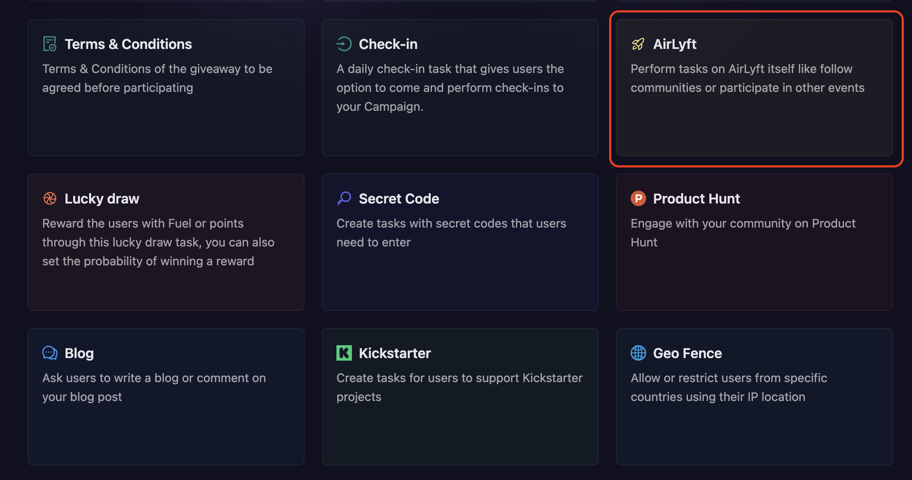
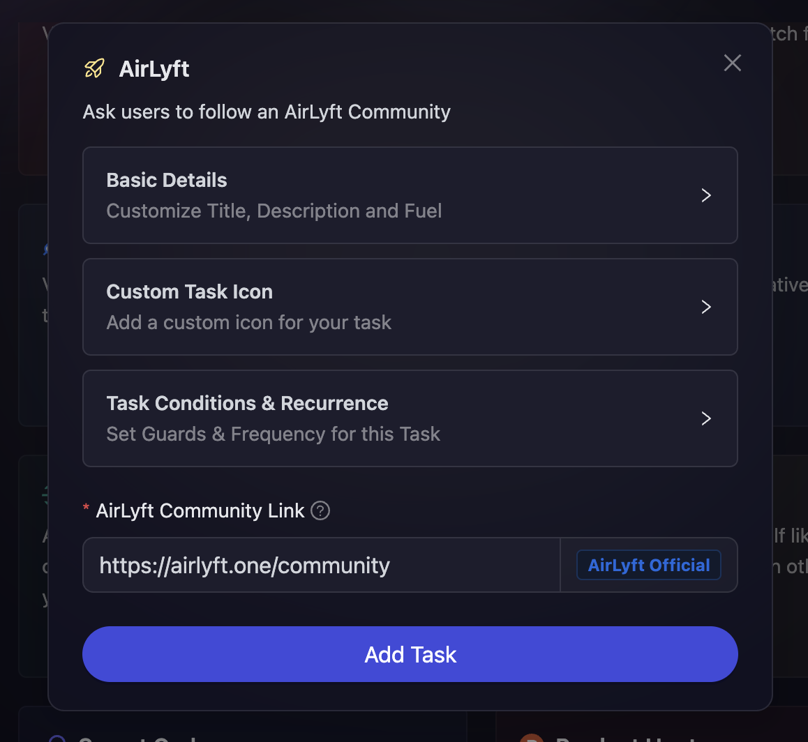

# AirLyft

The AirLyft module allows you to add tasks for users to perform directly on AirLyft. You can use this module to ask participants to follow other communities on the platform.

- On the event page, click on Quests tab where you can find the **AirLyft** block.

  

- Configure the basic details for your AirLyft task. For detailed instructions on setting up basic details, refer to the [Quest Basic Details](../quest-basic-details.md) guide.

- To configure the **Task Condition & Recurrence**, refer to the [Task Condition & Recurrence](../task-condition-and-recurrence.md) page.

- Add the link to the AirLyft community you want users to follow. If valid, the community name will auto-populate next to the link.

  

- Click on **Add Task**.
