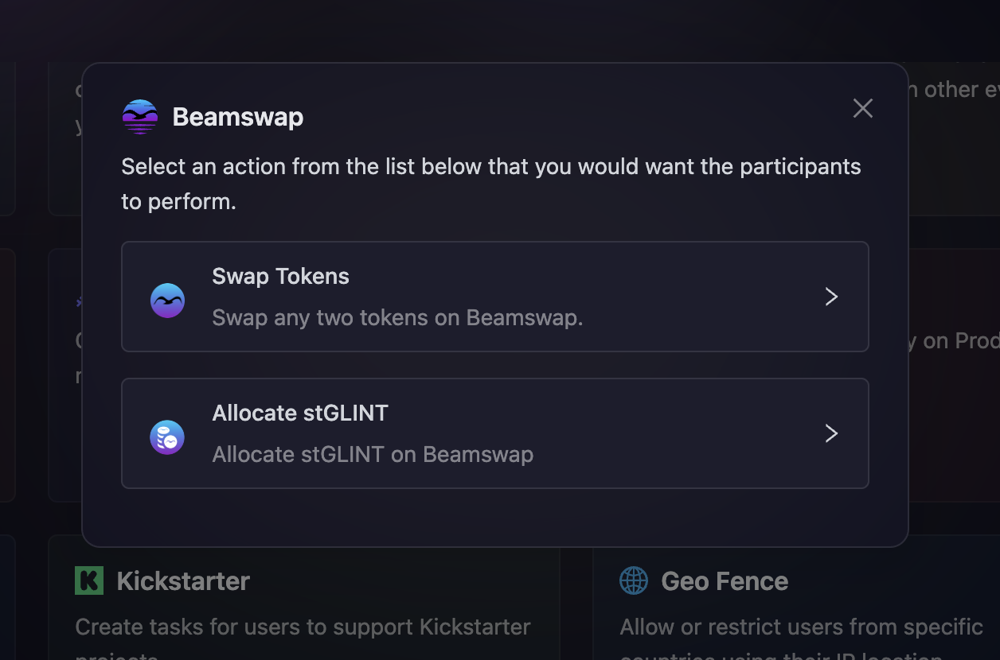

# Beamswap

[Beamswap](https://beamswap.io/) allows users to complete quests by performing specific on-chain actions, such as swapping tokens or allocating stGLINT. With AirLyft, communities can create tasks that require participants to engage with Beamswap, ensuring meaningful interactions while rewarding them for their participation.

For example, if you want users to swap tokens on Beamswap, you can create a task that verifies their transaction and rewards them accordingly. Similarly, if your campaign involves staking or liquidity allocation, you can set up a task that ensures users have allocated a minimum amount of stGLINT before claiming rewards. These tasks help drive engagement while maintaining transparency and fairness within your community.

Let's dive deep on how we can create these actions at AirLyft.

- On the Campaign page, click on Quests tab where you can find the **Beamswap** block as shown in the screenshot below.

  

- Select an action from the list below that you would want the participants to perform.

  - [Swap Tokens](#swap-any-two-tokens-on-beamswap)
  - [Allocate stGLINT](#allocate-stglint-on-beamswap)
 
  

### Swap any two tokens on Beamswap

Follow these simple steps below on how to [Swap any two tokens on Beamswap](https://app.beamswap.io/exchange/braindex).

- As shown in screenshot above, click on the **Swap Tokens** option.

- Next, configure the basic details for your token swap task. For detailed instructions on setting up basic details, refer to the [Quest Basic Details](../quest-basic-details.md) guide.

- To configure the **Task Condition & Recurrence**, refer to the [Task Condition & Recurrence](../task-condition-and-recurrence.md) page.

  

- Configure the swap conditions.

  - Select the token pair by choosing **Swap Token From** and **Swap Token To**
  - Set the **Check for Swaps After** date to specify when the system should start tracking transactions.

- Click on **Add Task**, and the Swap Token task will be successfully created.

### Allocate stGLINT on Beamswap

This task requires participants to [allocate a specified amount of stGLINT on Beamswap](https://app.beamswap.io/staking).

- As shown in screenshot above, click on the Allocate stGLINT option.

- Next, configure the basic details for your stGLINT allocation task. For detailed instructions on setting up basic details, refer to the [Quest Basic Details](../quest-basic-details.md) guide.

- To configure the **Task Condition & Recurrence**, refer to the [Task Condition & Recurrence](../task-condition-and-recurrence.md) page.

  

- Enter the **Minimum Amount** of stGLINT that participants need to allocate.

- Finally click on **Add Task** button and that's it the Allocate stGLINT task will be successfully created.

:::tip For instant help

1. Create a support ticket on our Discord: https://discord.gg/bx6ZCTwbYw
2. Join [this Telegram group](https://t.me/kyteone): https://t.me/kyteone

**_The AirLyft Team is there to help you. AirLyft is a platform to run marketing events, campaigns, quests and automatically distribute NFTs or Tokens as rewards._**

:::
