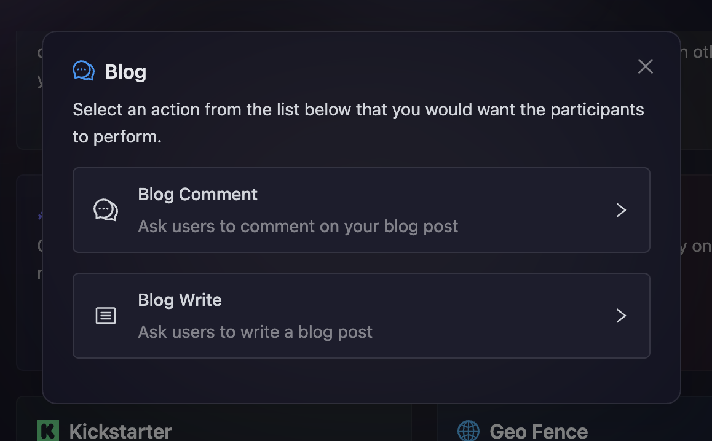

# Blog

Blog tasks enable you to drive engagement with your written content and encourage community participation in content creation. Whether you want participants to engage with existing blog posts through comments or create original content by writing their own blogs, these tasks help build a more engaged and content-rich community. In this module, we will be discussing the following Blog actions:

- [Blog Comment](#blog-comment)
- [Blog Write](#blog-write)

These actions provide flexibility in how you want your community to interact with blog content, supporting both engagement and content creation goals.

- On the event page, click on Quests tab where you can find the **Blog** block.

  

- After clicking on the Blog box, you will be presented with options for selecting Blog actions. Let's read in depth about each of them.

  

### Blog Comment

This task requires participants to comment on a specific blog post, encouraging engagement with your content and fostering community discussions.

- As shown in the screenshot above, click on the **Blog Comment** option.

- Configure the basic details for your Blog Comment task. For detailed instructions on setting up basic details, refer to the [Quest Basic Details](../quest-basic-details.md) guide.

- To configure the **Task Condition & Recurrence**, refer to the [Task Condition & Recurrence](../task-condition-and-recurrence.md) page.

- Enter the **Blog URL** of the blog post where you want participants to comment.

> Participants will need to provide their **Username** as proof that they commented on the blog post.

- You can select the type of verification you want for the task. To learn more about the verification types offered by AirLyft, refer to the [Verification Types](../quest-verification-type.md) guide. Both manual and automatic verification options are available.

- Finally, click on **Add Task** button to create your Blog Comment task.

### Blog Write

This task encourages participants to create original blog content, helping expand your community's content ecosystem and showcase community creativity.

- Click on the **Blog Write** option from the Blog task options.

- Configure the basic details for your Blog Write task. For detailed instructions on setting up basic details, refer to the [Quest Basic Details](../quest-basic-details.md) guide.

- To configure the **Task Condition & Recurrence**, refer to the [Task Condition & Recurrence](../task-condition-and-recurrence.md) page.

- Participants will need to provide the **Blog Link** to their published blog post for verification.

  

- You can select the type of verification you want for the task. To learn more about the verification types offered by AirLyft, refer to the [Verification Types](../quest-verification-type.md) guide. Both manual and automatic verification options are available.

- Finally, click on **Add Task** button to create your Blog Write task.

:::tip For instant help

1. Create a support ticket on our Discord: https://discord.gg/bx6ZCTwbYw
2. Join [this Telegram group](https://t.me/kyteone): https://t.me/kyteone

**_The AirLyft Team is there to help you. AirLyft is a platform to run marketing events, campaigns, quests and automatically distribute NFTs or Tokens as rewards._**

:::
