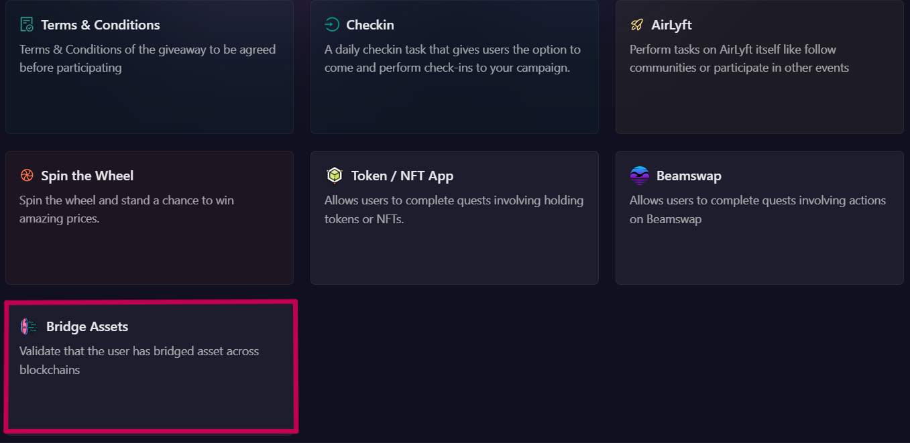
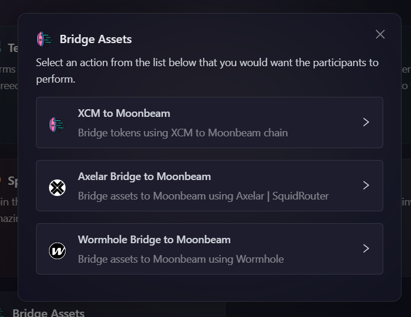
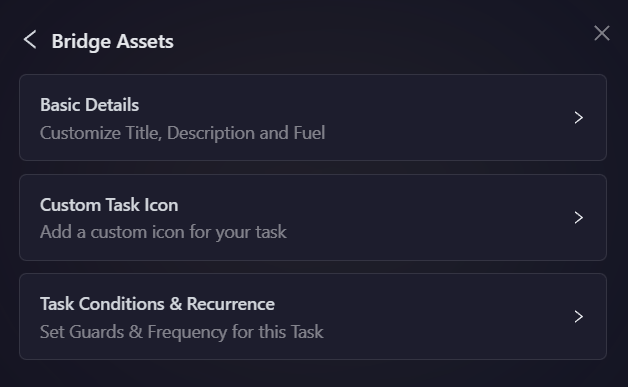
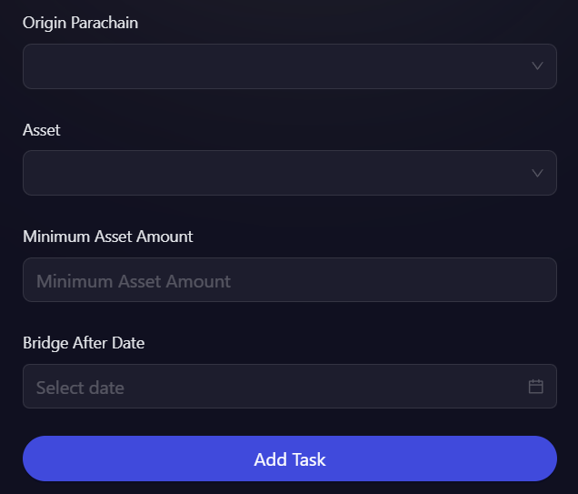
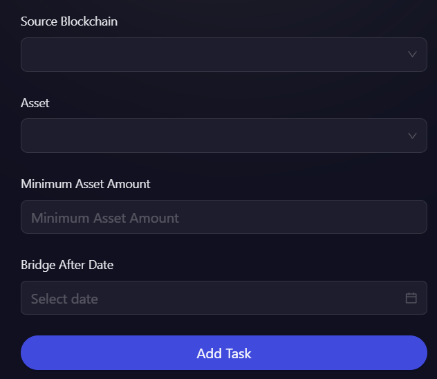
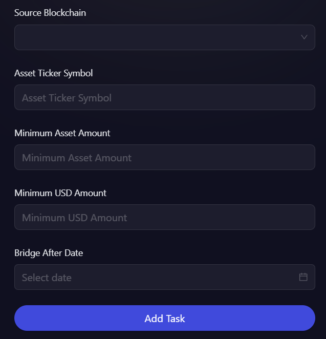

# Bridge Assets

Bridging assets involves transferring tokens between different blockchain networks. This process ensures seamless interoperability, allowing users to move their assets securely. On AirLyft, you can create quests that verify whether participants have successfully bridged assets using different protocols.

## Creating a Bridge Asset Quest on AirLyft

To set up a bridge asset quest, follow these steps:

- Login to AirLyft and create a campaign. Navigate to the Campaign page and click on the Quests tab, where you will find the Bridge Asset block as shown in the screenshot below.

  

- Choose the bridging method. Select how you want participants to bridge their assets from the following options:

  - [XCM to Moonbeam](#bridge-tokens-using-xcm-to-moonbeam-chain)
  - [Axelar Bridge to Moonbeam](#bridge-assets-to-moonbeam-using-axelar)
  - [Wormhole Bridge to Moonbeam](#bridge-assets-to-moonbeam-using-wormhole)

  

### Bridge tokens using XCM to Moonbeam chain

This task requires participants to bridge tokens from an XCM-compatible parachain to the Moonbeam chain.

You can use any of these official bridges for XCM transfers:

- [Moonbeam DApp](https://apps.moonbeam.network/moonbeam/xcm) - Official Moonbeam XCM transfer interface
- [Polkadot.js Apps](https://polkadot.js.org/apps/#/xcm-transfer) - Official Polkadot XCM transfer interface
- [Stellaswap](https://app.stellaswap.com/bridge) - DEX with integrated XCM bridge
- [BeamSwap](https://beamswap.io/bridge) - DEX with integrated XCM bridge

- As shown in screenshot above, Select the "XCM to Moonbeam" option.

- Next, click on the basic details option to enter the Title, Description, cFuel and XP. It is advisable to elaborate the title and description so that participants have a much greater understanding of task.

  

- To configure the **Task Condition & Recurrence**, refer to the [Task Condition & Recurrence](../task-condition-and-recurrence.md) page.

  

- Configure the bridge conditions.

  - Select the **Origin Parachain** and **Asset** from the available list.

  - Set the **Minimum Asset Amount** required for validation.

  - Define the **Bridge After Date** to ensure transactions are tracked from a specific point in time.

- Click on **Add Task**, and the XCM to Moonbeam task will be successfully created.

### Bridge assets to Moonbeam using Axelar

This task verifies whether participants have successfully bridged assets to the Moonbeam network using Axelar or SquidRouter.

- Select the "Axelar Bridge to Moonbeam" option.

- Next, click on the basic details option to enter the Title, Description, cFuel and XP. It is advisable to elaborate the title and description so that participants have a much greater understanding of task.

  

- To configure the **Task Condition & Recurrence**, refer to the [Task Condition & Recurrence](../task-condition-and-recurrence.md) page.

  

- Select the **Source Blockchain** and **Asset** from the given list.

- Set the **Minimum Asset Amount** required for the bridge transaction.

- Define the **Bridge After Date** to ensure only relevant transactions are considered.

- Click on **Add Task** button and that's it the Axelar Bridge to Moonbeam task will be successfully created.

### Bridge assets to Moonbeam using Wormhole

This task verifies whether participants have successfully bridged assets to the Moonbeam network using Wormhole.

- Select the "Wormhole Bridge to Moonbeam" option.

- Next, click on the basic details option to enter the Title, Description, cFuel and XP. It is advisable to elaborate the title and description so that participants have a much greater understanding of task.

  

- To configure the **Task Condition & Recurrence**, refer to the [Task Condition & Recurrence](../task-condition-and-recurrence.md) page.

  

- Select the **Source Blockchain** and **Asset** from the available options.

- Enter the **Asset Ticker Symbol** to specify the token being bridged.

- Set the **Minimum Asset Amount** and **Minimum USD Amount** required for verification.

- Define the **Bridge After Date** to ensure only transactions after this point are considered.

- Click on **Add Task** button and that's it the Wormhole Bridge to Moonbeam task will be successfully created.

:::tip For instant help

1. Create a support ticket on our Discord: https://discord.gg/bx6ZCTwbYw
2. Join [this Telegram group](https://t.me/kyteone): https://t.me/kyteone

**_The AirLyft Team is there to help you. AirLyft is a platform to run marketing events, campaigns, quests and automatically distribute NFTs or Tokens as rewards._**

:::
