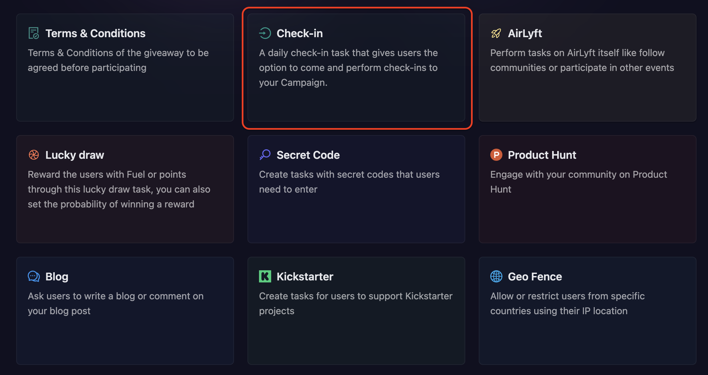
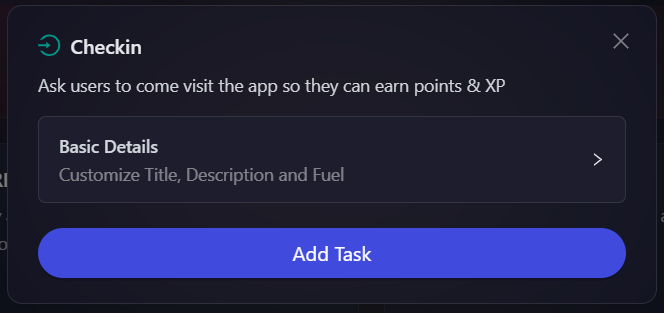

# Checkin

The Checkin module adds a simple checkin task to the campaign. Users visit the campaign link daily and click the 'checkin' button. This awards them with cFuel and XP, encouraging daily visits and increasing campaign views.

- On the event page, click on Quests tab where you can find the **Checkin** block.

  

- Configure the basic details to set the amount of cFuel and XP the participant will get each time they check in. For detailed instructions on setting up basic details, refer to the [Quest Basic Details](../quest-basic-details.md) guide.

- Click on **Add Task**. The Checkin task will be added.

  
