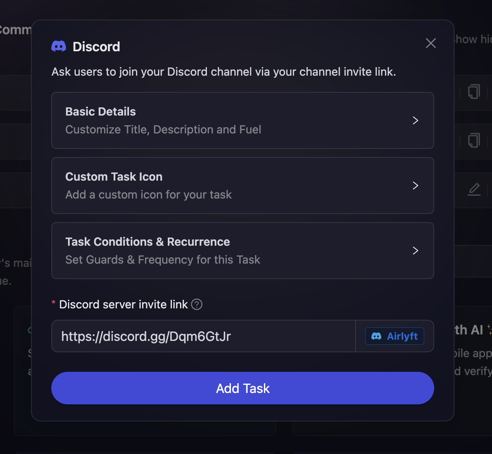

# Discord

AirLyft now supports Discord integration to promote your discord server. You can create Discord based tasks to check if participants have joined your discord server or not. Please follow the steps below on how to create a Discord tasks.

- When [creating a campaign](/campaign/#creating-a-campaign), you can find the **Discord** block in the quests section

  

- Configure the basic details for your Discord task. For detailed instructions on setting up basic details, refer to the [Quest Basic Details](../quest-basic-details.md) guide.

- To configure the **Task Condition & Recurrence**, refer to the [Task Condition & Recurrence](../task-condition-and-recurrence.md) page.

  

- After entering the basic details, enter your project's discord server invite link here. Please note that if your discord invite link is correct, AirLyft will auto populate the server it belongs to. Take a look at the screenshot below.

Make sure your Discord link does not expire before the end of the campaign.

:::tip For instant help

1. Create a support ticket on our Discord: https://discord.gg/bx6ZCTwbYw
2. Join [this Telegram group](https://t.me/kyteone): https://t.me/kyteone

**_The AirLyft Team is there to help you. AirLyft is a platform to run marketing events, campaigns, quests and automatically distribute NFTs or Tokens as rewards._**

:::
