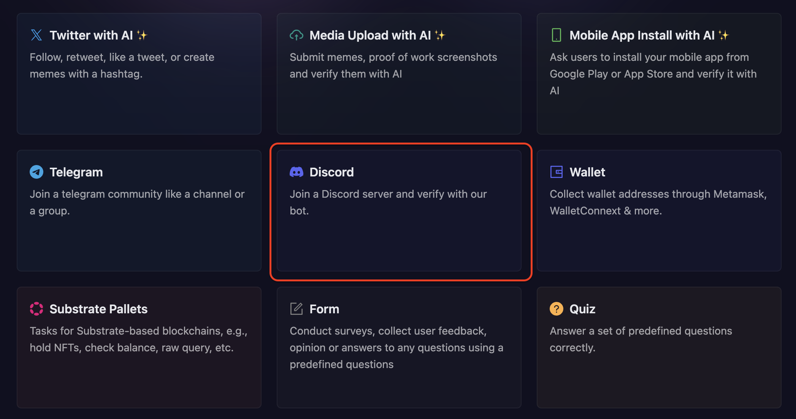
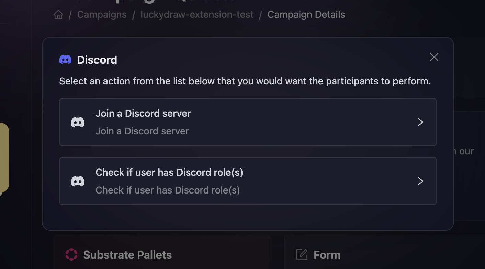
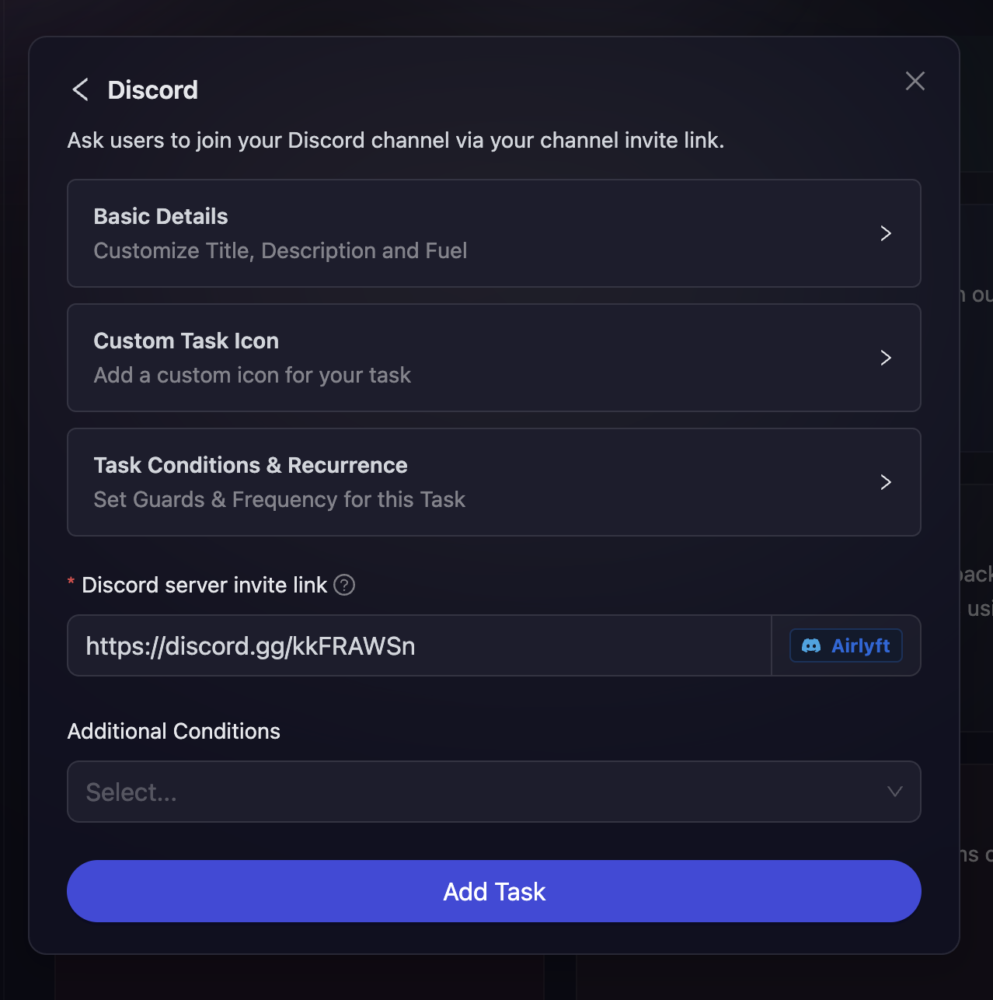
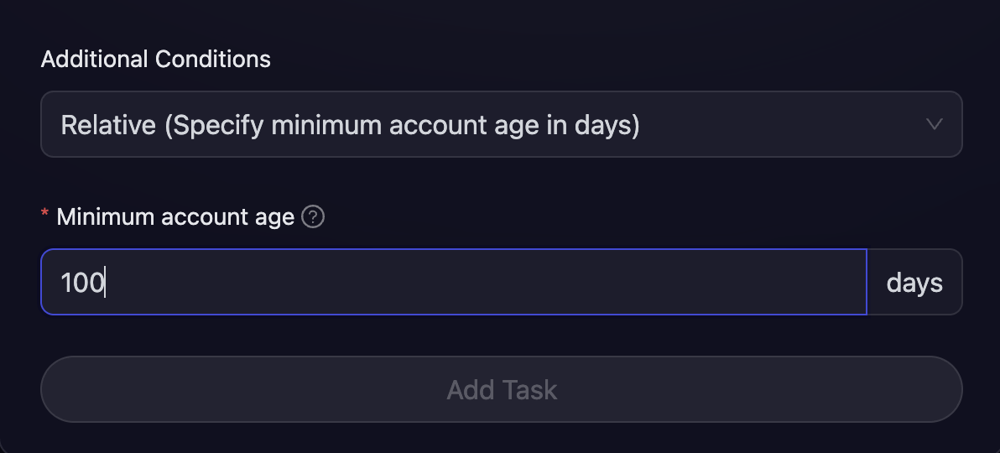
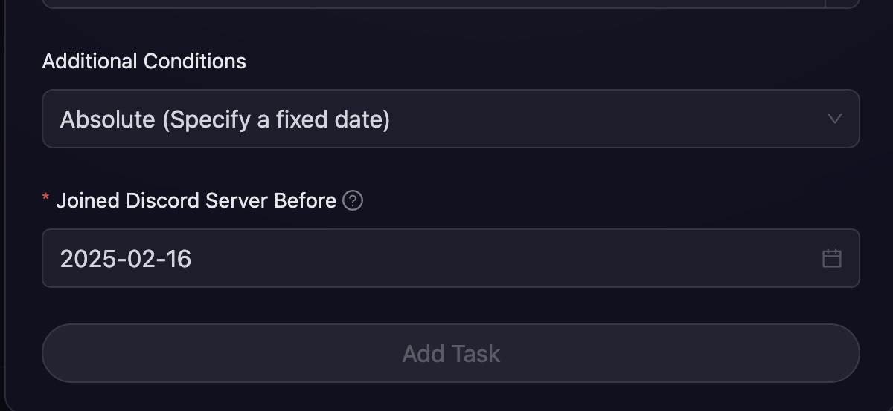
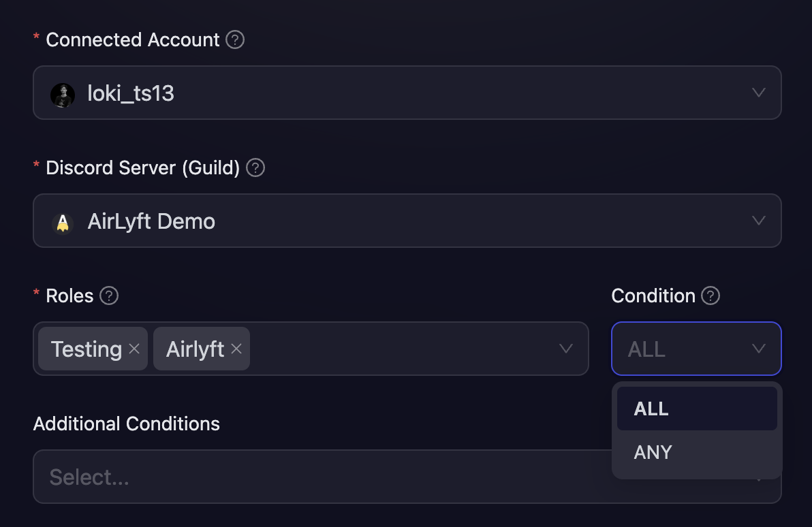

# Discord

AirLyft supports comprehensive Discord integration to help you grow and engage your Discord community. You can create Discord-based tasks to verify server membership and check for specific roles. This guide covers both task types and their configuration options.

- When [creating a campaign](/campaign/#creating-a-campaign), you can find the **Discord** block in the quests section

  

- There are two types of Discord tasks available:

  - [**Join a Discord server**](#join-a-discord-server): Verify that participants have joined your Discord server
  - [**Check if user has Discord role(s)**](#check-if-user-has-discord-roles): Verify that participants have specific roles in your Discord server

  

## Join a Discord server

This task type verifies that participants have joined your Discord server.

- Configure the basic details for your Discord task. For detailed instructions on setting up basic details, refer to the [Quest Basic Details](../quest-basic-details.md) guide.

- To configure the **Task Condition & Recurrence**, refer to the [Task Condition & Recurrence](../task-condition-and-recurrence.md) page.

  

- Enter your project's Discord server invite link. If your Discord invite link is correct, AirLyft will automatically populate the server it belongs to.

- Make sure your Discord link does not expire before the end of the campaign.

### Additional Conditions

Both Discord task types support additional time-based conditions to ensure participants have been members for a specific duration:

- **Relative (Specify minimum account age in days)**

  

  Set a minimum number of days that users must have been a member of the Discord server. For example, setting this to 100 days means only users who joined the server at least 100 days ago can verify the task.

- **Absolute (Specify a fixed date)**

  

  Set a specific date by which users must have joined the Discord server. For example, setting this to February 16, 2025 means only users who joined before that date can verify the task.

## Check if user has Discord role(s)

This task type verifies that participants have specific roles in your Discord server. This is useful for rewarding active community members or those with special privileges.

### Prerequisites

Before creating a role-checking task, you must first set up a Discord integration. Follow the [Discord Integration](../../integrations/discord.md) guide to connect your Discord account.

### Setting up the Role Check Task

- Configure the basic details for your Discord role task. For detailed instructions on setting up basic details, refer to the [Quest Basic Details](../quest-basic-details.md) guide.

- To configure the **Task Condition & Recurrence**, refer to the [Task Condition & Recurrence](../task-condition-and-recurrence.md) page.

  

- **Select Connected Account:** Choose your Discord account from the Connected Account dropdown. This account must be connected via the Discord integration.

- **Select Discord Server:** A list of all servers where you are the owner will be displayed. Select the server you want to use for role verification.

- **Add AirLyft Bot to Server:** If the AirLyft bot is not already added to your selected server, a prompt will appear with instructions. Follow the on-screen steps to add the bot to your server. This is required for AirLyft to verify user roles.

- **Select Roles:** After the bot is added, a list of all roles in your server will be displayed. Select which role(s) you want to check for.

- **Role Condition (for multiple roles):** If you select multiple roles, you can specify whether users need:

  - **ALL** selected roles to verify the task
  - **ANY** of the selected roles to verify the task

- The [Additional Conditions](#additional-conditions) section works the same way for role-checking tasks, allowing you to verify when users joined the server.

:::tip For instant help

1. Create a support ticket on our Discord: https://discord.gg/bx6ZCTwbYw
2. Join [this Telegram group](https://t.me/kyteone): https://t.me/kyteone

**_The AirLyft Team is there to help you. AirLyft is a platform to run marketing events, campaigns, quests and automatically distribute NFTs or Tokens as rewards._**

:::
