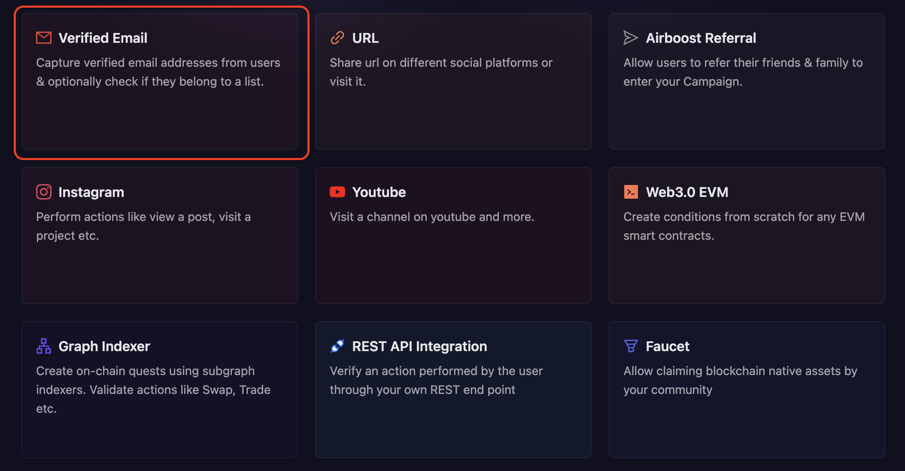
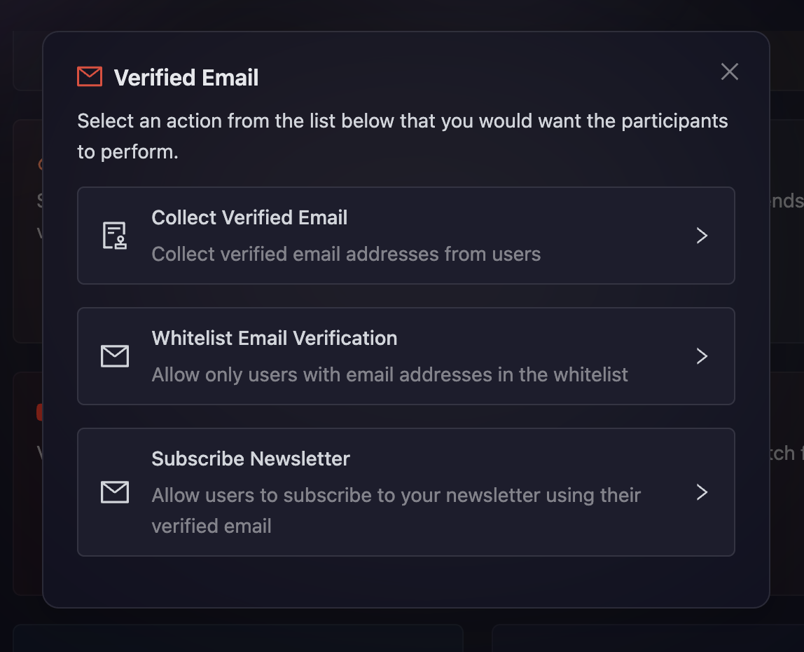
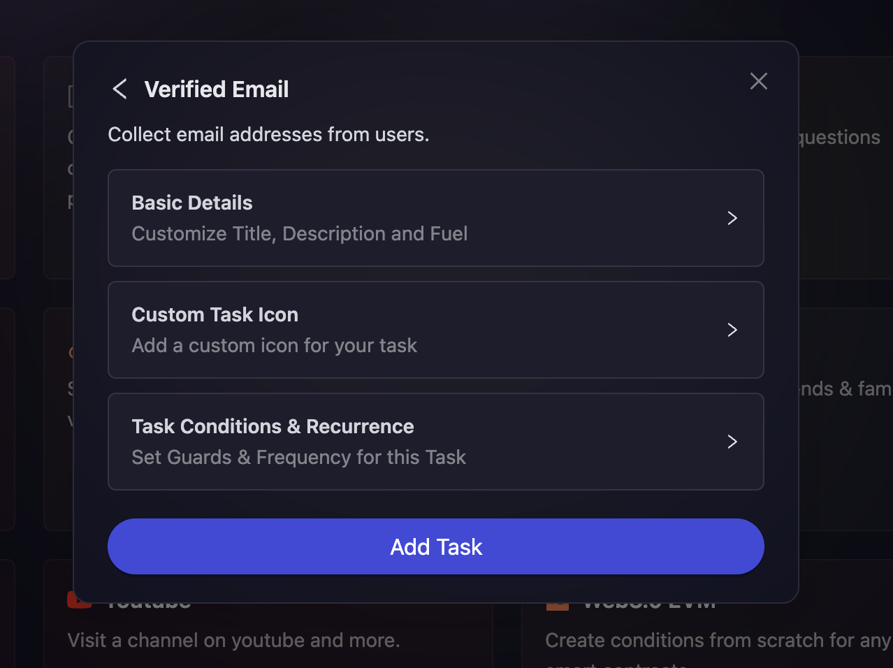
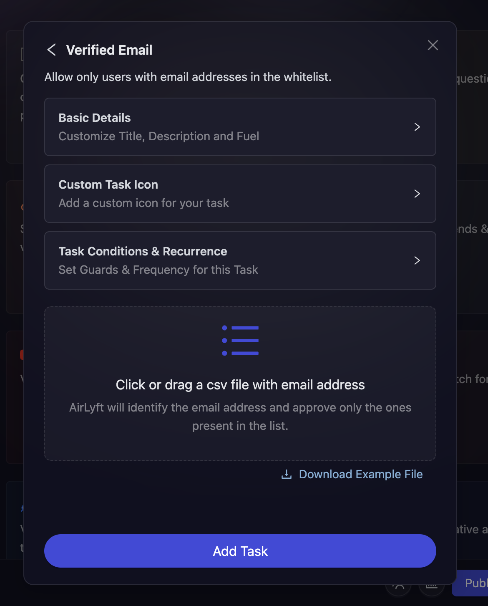
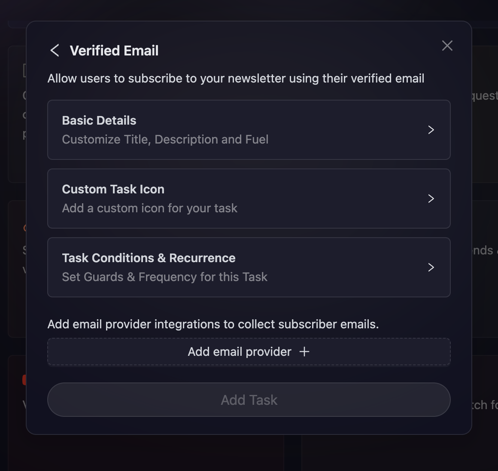

# Email

Emails are one of the best for of communication and gathering early-stage users. With that in mind, the team at AirLyft has created an innovative functionality for our projects that will give them the power to capture verified email addresses of their participants and also automatically create a method to check if they belong to a particular list or not.

For example, let's consider that you are a project providing crowd list early access to users who have been with you since the start. Now, you want them to reward cFuel/XP where only the early access list users can verify a particular task. From checking a verified email to cross-checking if a user's email address is available in the list or not, these tasks can be easily created at AirLyft.
In this module, we'll be discussing below Email actions:

- [Collect Verified Email](#collect-verified-email)
- [Whitelist Email Verification](#whitelist-email-verification)
- [Subscribe Newsletter](#subscribe-newsletter)

Let's dive deep on how we can create these actions at AirLyft.

- On the event page, click on Quests tab where you can find the **Verified Email** block as shown in the screenshot below.

  

- After clicking on the **Verified Email** box, you will then be presented with options for selecting Email Actions. Let's read in depth about each of them.

  

### Collect Verified Email

This module allows you to collect user's email addresses. Participants will need to have a verified email address connected to their AirLyft account in order to perform this task.

- Configure the basic details for your email task. For detailed instructions on setting up basic details, refer to the [Quest Basic Details](../quest-basic-details.md) guide.

- To configure the **Task Condition & Recurrence**, refer to the [Task Condition & Recurrence](../task-condition-and-recurrence.md) page.

- Click on **Add Task**

### Whitelist Email Verification

This module allows you to whitelist email address. Only emails in the whitelist would be able to perform this task.

- Configure the basic details for your email task. For detailed instructions on setting up basic details, refer to the [Quest Basic Details](../quest-basic-details.md) guide.

- To configure the **Task Condition & Recurrence**, refer to the [Task Condition & Recurrence](../task-condition-and-recurrence.md) page.

- Upload a CSV of emails you'd like to whitelist. You can download a sample file from the **Download Example File** button and enter the required email addresses in the CSV file for upload. Based on the CSV file uploaded, AirLyft's internal verification algorithm would check if the participant's email address is available in the list or not.

- Click on **Add Task**

### Subscribe Newsletter

This module allows you to integrate and connect your existing tools and services with AirLyft. To learn more about integrations on AirLyft, follow the [Integrations](../../integrations/index.md) guide.

- Configure the basic details for your email task. For detailed instructions on setting up basic details, refer to the [Quest Basic Details](../quest-basic-details.md) guide.

- To configure the **Task Condition & Recurrence**, refer to the [Task Condition & Recurrence](../task-condition-and-recurrence.md) page.

- Choose your provider from the **Add Email Provider** dropdown.

- Click on **Add Task**

:::tip For instant help

1. Create a support ticket on our Discord: https://discord.gg/bx6ZCTwbYw
2. Join [this Telegram group](https://t.me/kyteone): https://t.me/kyteone

**_The AirLyft Team is there to help you. AirLyft is a platform to run marketing events, campaigns, quests and automatically distribute NFTs or Tokens as rewards._**

:::
