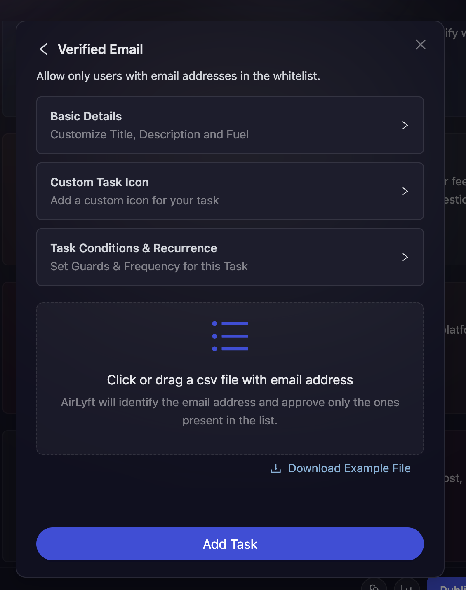

# Email

Emails are one of the best for of communication and gathering early-stage users. With that in mind, the team at AirLyft has created an innovative functionality for our projects that will give them the power to capture verified email addresses of their participants and also automatically create a method to check if they belong to a particular list or not.

For example, let's consider that you are a project providing crowd list early access to users who have been with you since the start. Now, you want them to reward entries where only the early access list users can verify a particular task. From checking a verified email to cross-checking if a user's email address is available in the list or not, these tasks can be easily created at AirLyft.

Let's dive deep on how we can create these actions at AirLyft.

- Login to AirLyft and create an event. On the event page, click on Quests tab where you can find the Verified Email block as shown in the screenshot below. 

- Next, expand the 'Basic Details' option to enter the Title, Description, cFuel and XP. It is advisable to elaborate on the title and description so that participants have a much greater understanding of the task.

- Then expand 'Task Condition and Recurrence' option to set the task frequency and task conditions. 
    - 'Task Frequency' determines how often users can complete a task. There are four options:
        - **None:** The task can only be completed once.
        - **Daily:** The task resets daily at midnight.
        - **Weekly:** The task resets at the start of every week.
        - **Monthly:** The task resets at the start of every month.

    - 'Task Conditions' determines if a user can perform a task or not. There are four options:
        - **Task Completed:** It only allows a user to perform a task if he has either completed or not completed another task.
        - **Date:** It only allows user to perform a task before or after the set date.
        - **Max Participants:** The task is locked after a certain number of users have completed it.

- Coming to the main part, which is Verification type, projects are provided with 2 options as mentioned below. 
    - **Reward Entries to all verified members**: As the name suggests, entries will be rewarded to every participant who would enter their email and verify those emails by clicking on the verification link that will be generated. Please check your SPAM folder too if the email isn't in your inbox. 

    - **Reward Entries to specific whitelisted email addresses only**: Upon selecting this option, you will be provided with an option to click and upload or drag a CSV file that contains all the email addresses. You can download a sample file from the download link below and enter the required email addresses in the CSV file for upload. Based on the CSV file uploaded, AirLyft's internal verification algorithm would check if the participant's email address is available in the list or not and then reward entries. 

    

- Finally click on Add Task button and that's it. You have created your Verified Email task successfully. 

:::tip For instant help

1. Create a support ticket on our Discord: https://discord.gg/bx6ZCTwbYw
2. Join [this Telegram group](https://t.me/kyteone): https://t.me/kyteone

**_The AirLyft Team is there to help you. AirLyft is a platform to run marketing events, campaigns, quests and automatically distribute NFTs or Tokens as rewards._**

:::