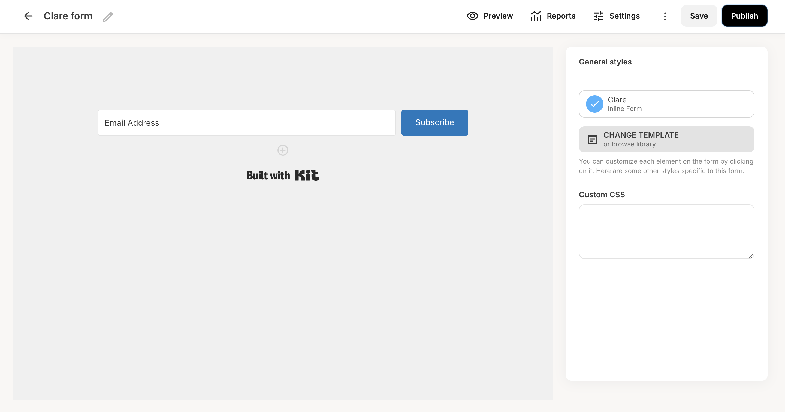
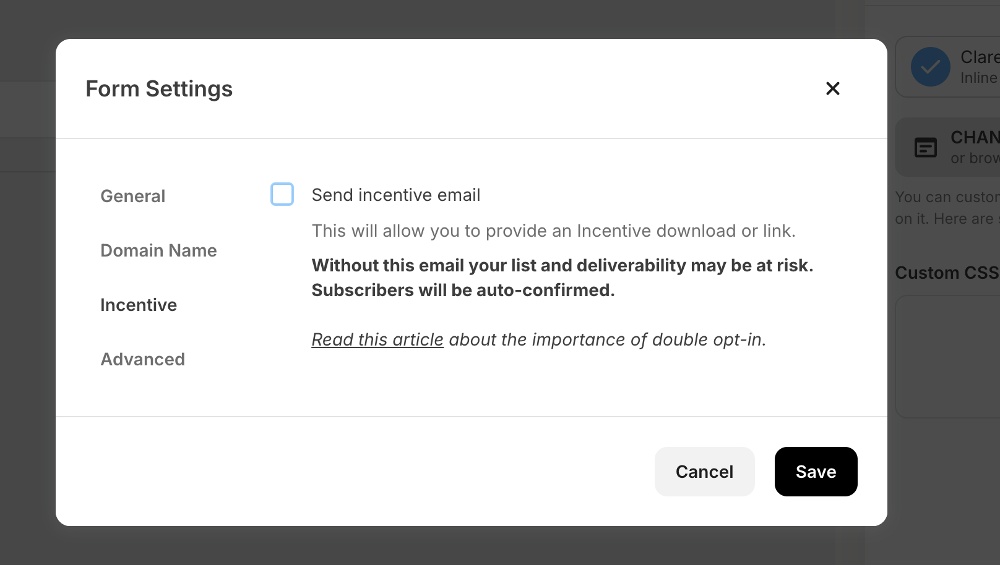

# ConvertKit (Kit)

ConvertKit is an email marketing tool that helps creators build and manage their audience. Use this integration to verify subscribers as part of your AirLyft campaign tasks.

## Setting Up ConvertKit Integration

To integrate ConvertKit with your AirLyft campaign, you'll need to obtain your API key and Form ID. Follow these steps:

### Obtaining your API Key:

- Log in to your ConvertKit account
- Click on the top right profile icon
- Select "Settings"
- Navigate to the "Developer" tab
- Generate a v3 API Key or copy your existing one

### Finding your Form ID:

- From your ConvertKit dashboard, click on the "Grow" dropdown tab
- Select "Landing Pages & Forms"
- Create a new form (Clear Form) with email input box only
- Save the form

- Go to the settings and then the "Incentive" tab
- Uncheck "Send incentive email" and check "Auto-confirm new subscribers"
- Save the settings

- Copy the Form ID from the URL: "app.convertkit.com/forms/designers/`7840253`/edit".

You can view all subscribers in your ConvertKit account by clicking on the "Grow" dropdown tab and then selecting "Subscribers".

If you are facing any issues with the ConvertKit integration, please contact [support@airlyft.freshdesk.com](mailto:support@airlyft.freshdesk.com)!
