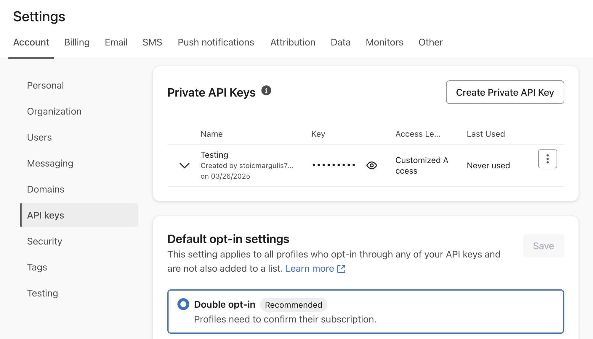
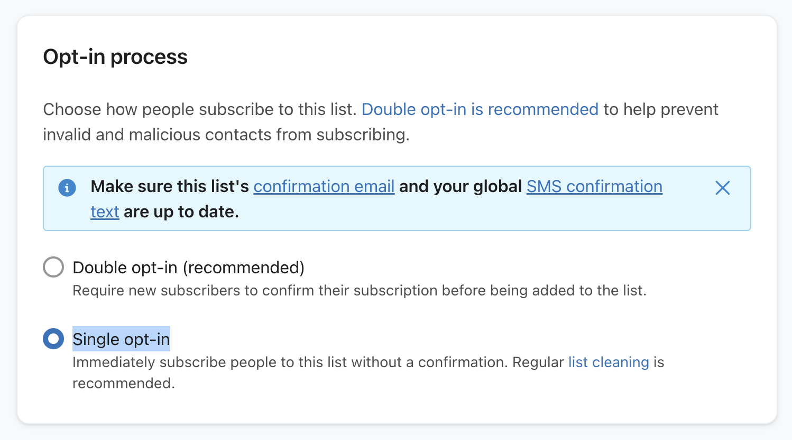

# Klaviyo

Klaviyo is a powerful email marketing platform that helps businesses create personalized customer experiences. Use this integration to verify subscribers as part of your AirLyft campaign tasks.

## Setting Up Klaviyo Integration

To integrate Klaviyo with your AirLyft campaign, you'll need to obtain your API key and List ID. Follow these steps:

### Obtaining your API Key:

- Log in to your Klaviyo dashboard
- Click on the button in the top right corner labeled "Account Plans"
- Navigate to "Account" → "API Keys"
- Generate a private API key

### Finding your List ID:

- From your Klaviyo dashboard, navigate to "Audience" then "Lists and Segments"
- Create a new list or use an existing one
- Open the list
- Navigate to "Settings" → "Consent"
- In "Opt-in process", select the "Single opt-in" option
- Your List ID can be found in the URL: "klaviyo.com/list/`Y5HSa4`"

You can view all subscribers by opening the list from the Audience section.

If you are facing any issues with the Klaviyo integration, please contact [support@airlyft.freshdesk.com](mailto:support@airlyft.freshdesk.com)!
