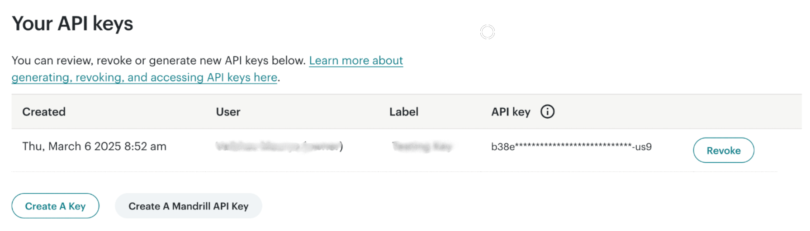
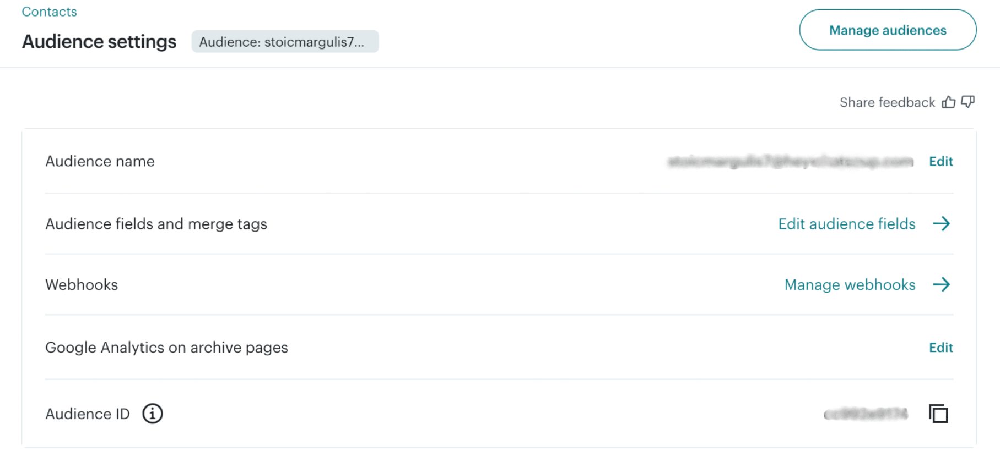

# Mailchimp

AirLyft has integrated with Mailchimp, one of the most popular email marketing platforms, to help you grow and engage your community. This integration allows you to verify if participants are subscribed to your mailing list as part of your campaign tasks.

## Setting Up Mailchimp Integration

To integrate Mailchimp with your AirLyft campaign, you'll need to obtain your API key and Audience ID. Follow these steps:

### Obtaining your API Key:

- Log in to your Mailchimp account
- Click on the top right profile icon
- Select "Account & Billing"
- Navigate to "Extras" and then "API Key"
- Generate a new API key or copy your existing one

### Finding your Audience ID:

- From your Mailchimp dashboard, navigate to the "Audience" tab
- Click on "All Contacts"
- Your Audience ID will be displayed on this page (it appears as a string of letters and numbers)

You can view all subscribers in your Mailchimp account under Audience → All Contacts.

If you are facing any issues with the Mailchimp integration, please contact [support@airlyft.freshdesk.com](mailto:support@airlyft.freshdesk.com)!
