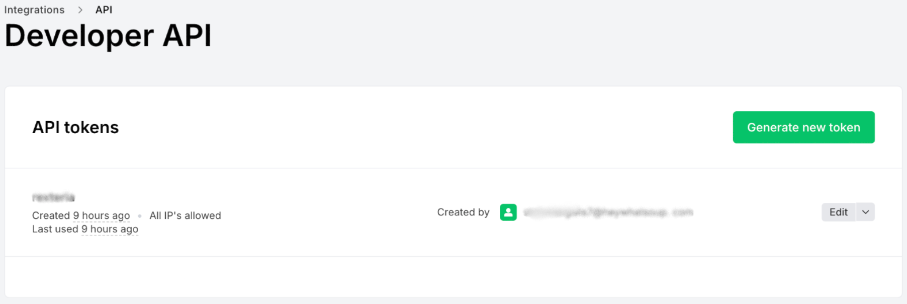

# MailerLite

MailerLite is a user-friendly email marketing platform that makes it easy to create and manage email campaigns. Use this integration to verify subscribers as part of your AirLyft campaign tasks.

## Setting Up MailerLite Integration

To integrate MailerLite with your AirLyft campaign, you'll need to obtain your API Access Token. Follow these steps:

### Obtaining your Access Token:

- Log in to your MailerLite dashboard
- Navigate to "Integrations" → "API"
- Generate an API Token

### Managing Subscribers

You can view all subscribers in your MailerLite account by navigating to the "Subscribers" tab in your dashboard.

If you are facing any issues with the MailerLite integration, please contact [support@airlyft.freshdesk.com](mailto:support@airlyft.freshdesk.com)!
