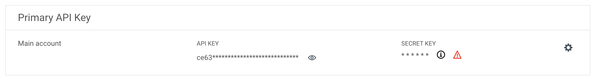

# Mailjet

Mailjet is a comprehensive email marketing solution for businesses of all sizes. Use this integration to verify subscribers as part of your AirLyft campaign tasks.

## Setting Up Mailjet Integration

To integrate Mailjet with your AirLyft campaign, you'll need to obtain your API Key and Secret Key. Follow these steps:

### Obtaining your API and Secret Keys:

- Log in to your Mailjet dashboard
- Navigate to the "API" tab → "API Key Management"
- Generate or copy your existing API Key and Secret Key

### Managing Subscribers

You can view all subscribers in your Mailjet account by navigating to the "Contacts" tab → "All Contacts".

If you are facing any issues with the Mailjet integration, please contact [support@airlyft.freshdesk.com](mailto:support@airlyft.freshdesk.com)!
