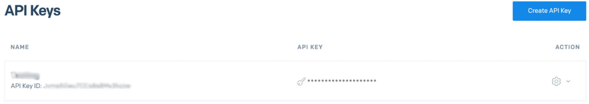

# SendGrid

SendGrid is a leading email delivery platform that enables businesses to send transactional and marketing emails. Use this integration to verify subscribers as part of your AirLyft campaign tasks.

## Setting Up SendGrid Integration

To integrate SendGrid with your AirLyft campaign, you'll need to obtain your API Key. Follow these steps:

### Obtaining your API Key:

- Log in to your SendGrid dashboard
- Navigate to "Settings"
- Click on the "API Keys" tab
- Generate a new API key

### Managing Subscribers

You can view all subscribers in your SendGrid account by:

- Navigating to "Marketing"
- Clicking on "Contacts" → "Global" (all contacts)

If you are facing any issues with the SendGrid integration, please contact [support@airlyft.freshdesk.com](mailto:support@airlyft.freshdesk.com)!
