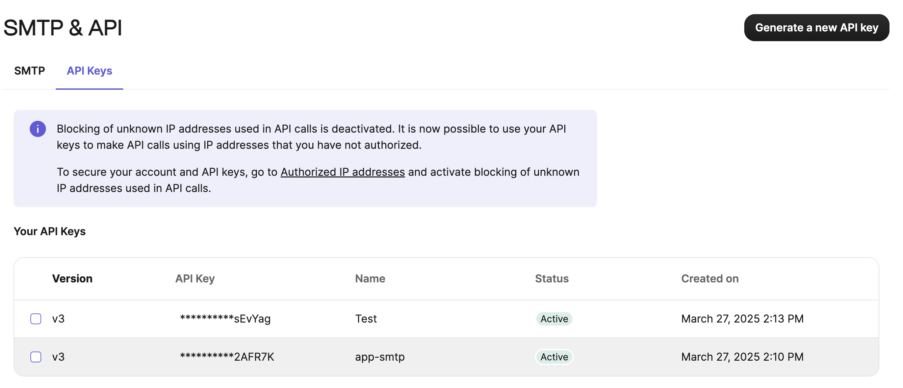
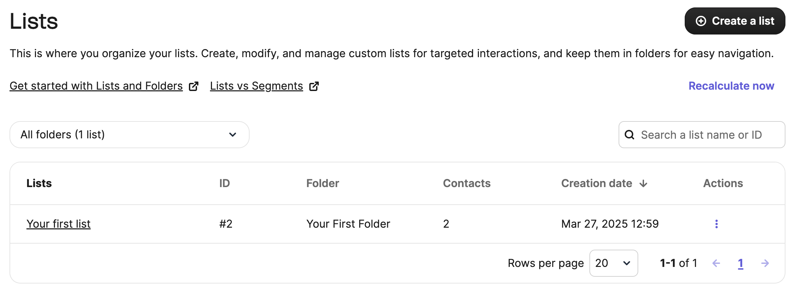

# Sendinblue (Brevo)

Sendinblue (now Brevo) is an all-in-one marketing platform that helps businesses connect with customers through email, SMS, and more. Use this integration to verify subscribers as part of your AirLyft campaign tasks.

## Setting Up Sendinblue Integration

To integrate Sendinblue with your AirLyft campaign, you'll need to obtain your API Key and List ID. Follow these steps:

### Obtaining your API Key:

- Log in to your Sendinblue dashboard
- Click on the top right profile icon, and select "SMTP & API" from the dropdown
- Navigate to the "API Keys" tab
- Generate a new API key

### Finding your List ID:

- Navigate to "Contacts" → "Lists"
- Create a new list or select an existing one
- On the lists tab, locate the ID of the created list

### Managing Subscribers

You can view all subscribers by clicking on a specific list to see all its members.

If you are facing any issues with the Sendinblue integration, please contact [support@airlyft.freshdesk.com](mailto:support@airlyft.freshdesk.com)!
