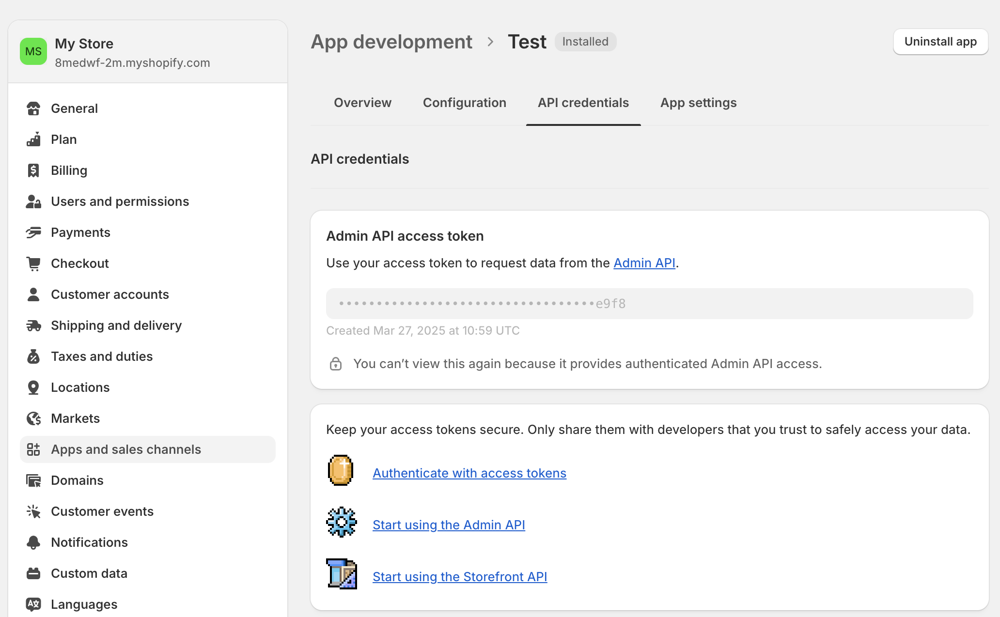
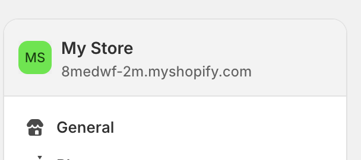

# Shopify

Shopify is a leading e-commerce platform that helps businesses create and manage online stores. Use this integration to verify your store's customers as part of your AirLyft campaign tasks.

## Setting Up Shopify Integration

To integrate Shopify with your AirLyft campaign, you'll need to obtain your Access Token and Store Name. Follow these steps:

### Obtaining your Access Token:

- Log in to your Shopify dashboard
- Click on "Settings" in the bottom left corner
- Navigate to "Apps and sales channels"
- Click on "Develop apps"
- Create a new app
- Navigate to "API credentials"
- Create an Admin API access token

### Finding your Store Name:

- In Settings, locate your profile where it shows "My store"
- Your store domain appears as "`8medwf-2m`.myshopify.com"
- The highlighted portion is your store name
- You can also find your store name in the URL: "admin.shopify.com/store/`8medwf-2m`"

### Managing Customers

You can view all your customers by navigating to the "Customers" tab on your Shopify dashboard.

If you are facing any issues with the Shopify integration, please contact [support@airlyft.freshdesk.com](mailto:support@airlyft.freshdesk.com)!
