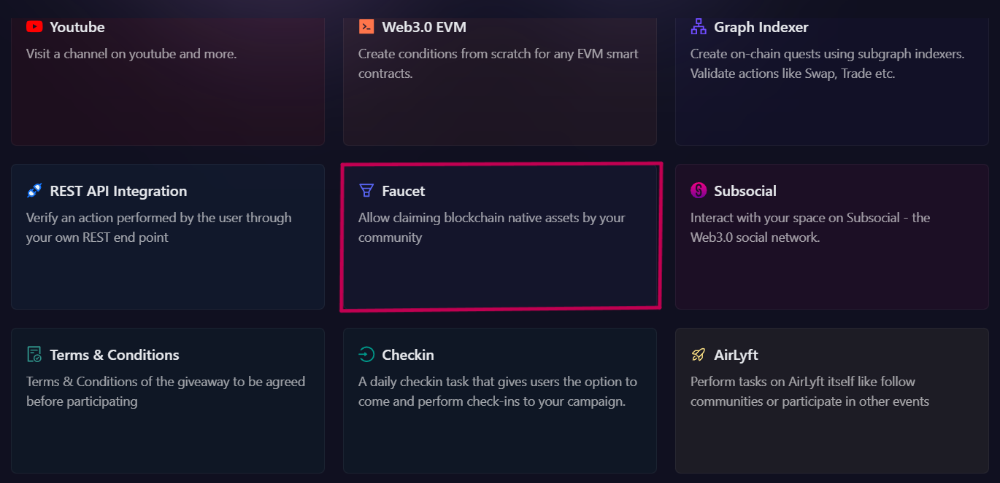
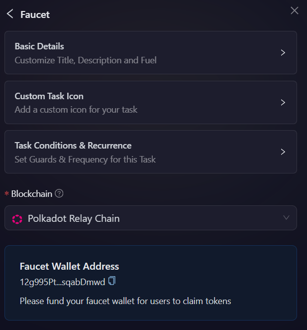
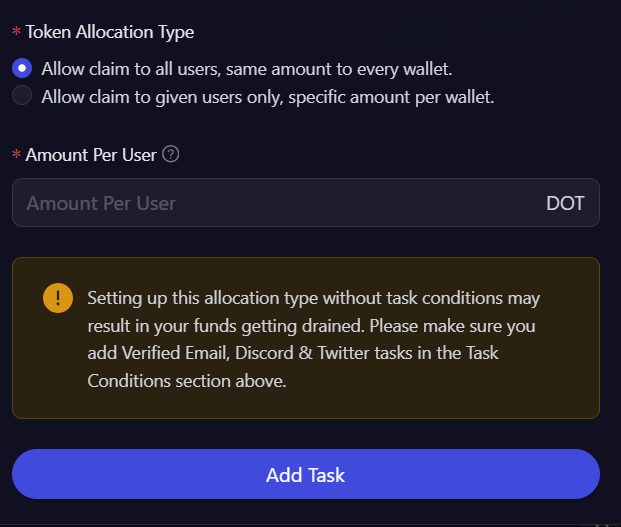
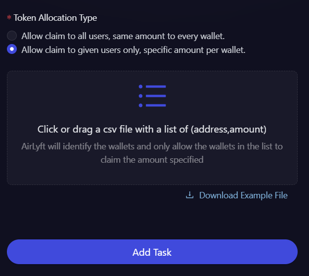

# Faucet

Faucets are a powerful tool for engaging and rewarding early-stage users within your community. With this in mind, the team at AirLyft has developed an intuitive faucet feature that allows communities to distribute blockchain-native assets to participants in a seamless and controlled manner.

Imagine you are running a Web3 project that grants early access to users who have supported you since the beginning. You want to reward these users by allowing them to claim tokens, but only after verifying their eligibility. With AirLyft, you can create tasks that ensure only qualified participants can claim rewards.

For example, you can check if their wallet address is on an approved whitelist. This streamlined process ensures that rewards go to genuine supporters while maintaining security and fairness within your community.

Let's dive deep on how we can create these actions at AirLyft.

- Login to AirLyft and create a campaign. On the Campaign page, click on Quests tab where you can find the Verified Faucet block as shown in the screenshot below.

  

- Select an action from the list below that you would want the participants to perform.

  - Select **Dotsama Faucet** to Transfer native dotsama asset to a participant .

  - Select **EVM Faucet** to Transfer EVM gas token to a participant.

    

- Next, expand the 'Basic Details' option to enter the Title, Description, cFuel and XP. It is advisable to elaborate on the title and description so that participants have a much greater understanding of the task.

- Then expand 'Task Condition and Recurrence' option to set the task frequency and task conditions.

  - 'Task Frequency' determines how often users can complete a task. There are four options:

    - **None:** The task can only be completed once.
    - **Daily:** The task resets daily at midnight.
    - **Weekly:** The task resets at the start of every week.
    - **Monthly:** The task resets at the start of every month.

  - 'Task Conditions' determines if a user can perform a task or not. There are four options:
    - **Task Completed:** It only allows a user to perform a task if he has either completed or not completed another task.
    - **Date:** It only allows user to perform a task before or after the set date.
    - **Max Participants:** The task is locked after a certain number of users have completed it.

  

- Next, select the **Blockchain**, and AirLyft will automatically fetch the wallet address. Ensure that your faucet wallet has sufficient funds to process the token claims.

- The key part of the setup is Token Allocation, where communities can choose between two distribution methods.

  - **Allow claim to all users, same amount to every wallet.**: As the name suggests, tokens will be rewarded to every participant and the amount will be same for all.

    - Here you enter the **Amount Per User**. This is is amount of tokens that can be claimed by each participant.

    

  - **Allow claim to given users only, specific amount per wallet.**: Upon selecting this option, you will be provided with an option to click and upload or drag a CSV file that contains all the addresses and amount. AirLyft will identify the wallets and only allow the wallets in the list to claim the amount specified.

    - You can download a sample file from the download link below and enter the required email addresses in the CSV file for upload.

    

    - Finally click on Add Task button and that's it.

:::tip For instant help

1. Create a support ticket on our Discord: https://discord.gg/bx6ZCTwbYw
2. Join [this Telegram group](https://t.me/kyteone): https://t.me/kyteone

**_The AirLyft Team is there to help you. AirLyft is a platform to run marketing events, campaigns, quests and automatically distribute NFTs or Tokens as rewards._**

:::
