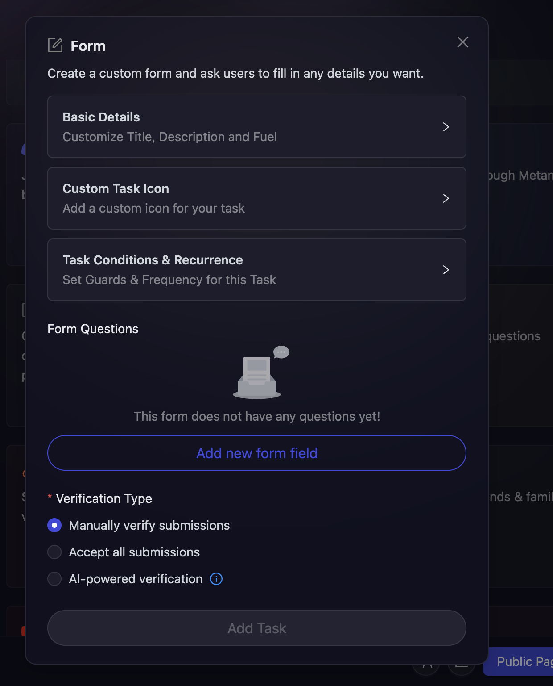
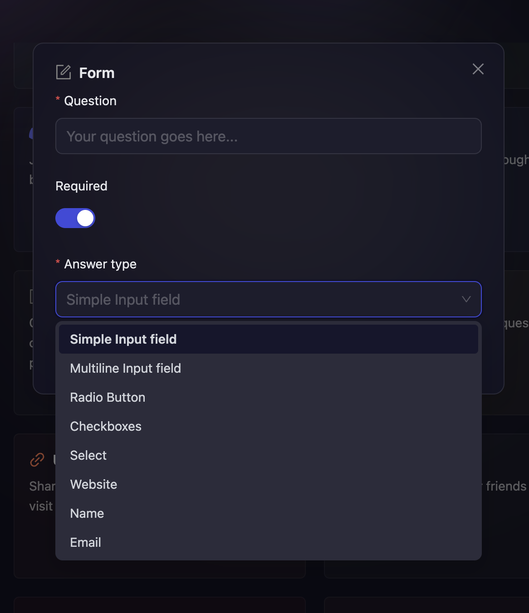

# Form

Forms are an integral part of growth activities when you want to take users' input for some or the other action. With that in mind, AirLyft has successfully integrated its Form using which you can receive users' data which would be accessible just by the project owners. Let's dive deep into how to create form tasks at AirLyft.

- Click on Quest where you can find the **Form** option.

  

- Next, configure the basic details for your form task. For detailed instructions on setting up basic details, refer to the [Quest Basic Details](../quest-basic-details.md) guide.

- To configure the **Task Condition & Recurrence**, refer to the [Task Condition & Recurrence](../task-condition-and-recurrence.md) page.

  

- Once the basic details have been filled in, click on the **Add New Form Field** button.

- You will now be presented with three options which are Question, Required, and Answer Type. In the Questions Field, you can ask what users need to enter based on which the participants would be filling the form.

- You can mark a question as Required or Not.

- Next step is to choose the Answer Type. At AirLyft, answer types are of 8 different types.
  - Simple Input Field - For entries on a single line.
  - Multiline Input Field - For entries on multiple lines.
  - Radio - For entries of choosing single options.
  - Checkboxes - For entries of choosing multiple options.
  - Select - For a selection of one option.
  - Website - For entries of URL.
  - Name - For entries of name.
  - Email - For entries of email.

Recently our partner used this integration in their giveaways where they created a form to collect Names (Simple Input Field), addresses (Multiline Input Field), Tshirt Size (Radio Button), and Colors (Checkboxes). Similarly, based on your requirements and campaign strategy, you can create form tasks and accept users' inputs. Some of the giveaways campaigns you can run here are reward survey, optin form, online contest entry form, etc.

- You can also select the type of verification you want for the task. To learn more about the verification types offered by AirLyft, you can refer to [Verification Types](../quest-verification-type.md) guide.

- Finally, Click on apply on Form Fields to add it to the form and then click on Add Tasks to create a Form Task.

If you are facing any issues with Form task creation, please drop a line at [support@airlyft.freshdesk.com](mailto:support@airlyft.freshdesk.com)!
