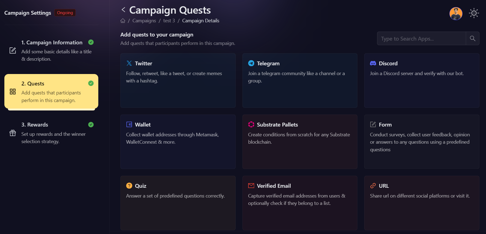
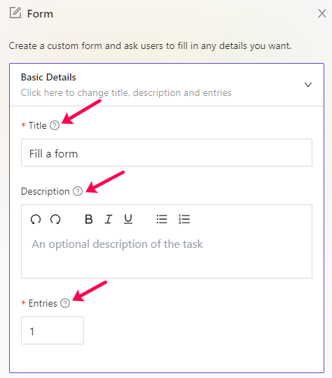
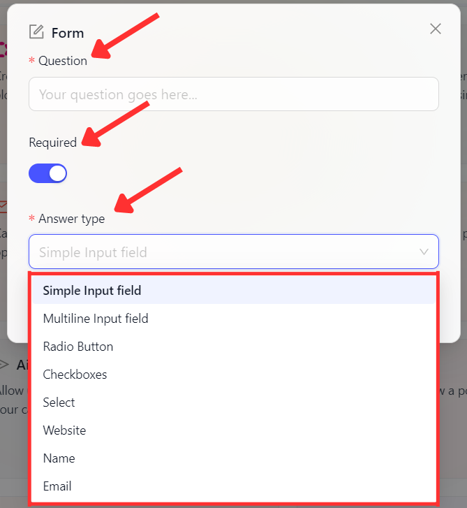
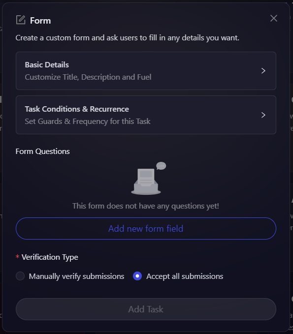

# Form

Forms are an integral part of growth activities when you want to take users' input for some or the other action. With that in mind, AirLyft has successfully integrated its Form using which you can receive users' data which would be accessible just by the project owners. Let's dive deep into how to create form tasks at AirLyft. 

- First, log in to AirLyft and head over to the Quests tab under Campaign Information where you can find the Form option.

- Next, click on the basic details option to enter the Title, Description, cFuel and XP. It is advisable to elaborate on the title and description so that participants have a much greater understanding of the task.

- Then expand 'Task Condition and Recurrence' option to set the task frequency and task conditions. 
    - 'Task Frequency' determines how often users can complete a task. There are four options:
        - **None:** The task can only be completed once.
        - **Daily:** The task resets daily at midnight.
        - **Weekly:** The task resets at the start of every week.
        - **Monthly:** The task resets at the start of every month.

    - 'Task Conditions' determines if a user can perform a task or not. There are four options:
        - **Task Completed:** It only allows a user to perform a task if he has either completed or not completed another task.
        - **Date:** It only allows user to perform a task before or after the set date.
        - **Max Participants:** The task is locked after a certain number of users have completed it.

- Once the basic details have been filled in, the next step is to click on **Add New Form Field**. 

- You will now be presented with three options which are Question, Required, and Answer Type. In the Questions Field, you can ask what users need to enter based on which the participants would be filling the form and then you can mark this question as Required or Not. 

- Next step is to choose the Answer Type. At AirLyft, answer types are of 5 different types.
    - Simple Input Field - For entries on a single line.
    - Multiline Input Field - For entries on multiple lines.
    - Radio - For entries of choosing single options.
    - Checkboxes - For entries of choosing multiple options.
    - Select - For a selection of one option. 
    - Website - For entries of URL.
    - Name - For entries of name.
    - Email - For entries of email.

Recently our partner used this integration in their giveaways where they created a form to collect Names (Simple Input Field), addresses (Multiline Input Field), Tshirt Size (Radio Button), and Colors (Checkboxes). Similarly, based on your requirements and campaign strategy, you can create form tasks and accept users' inputs. Some of the giveaways campaigns you can run here are reward survey, optin form, online contest entry form, etc.

- You can also select the type of verification you want for the task. There are two options:
    - **Manually verify submissions:** Manually select which submission to mark as valid.
    - **Accept all submissions:** All submissions are automatically marked as valid.

- Finally, Click on apply on Form Fields to add it to the form and then click on Add Tasks to create a Form Task. 

If you are facing any issues with Form task creation, please drop a line at ** support@kyte.one **!