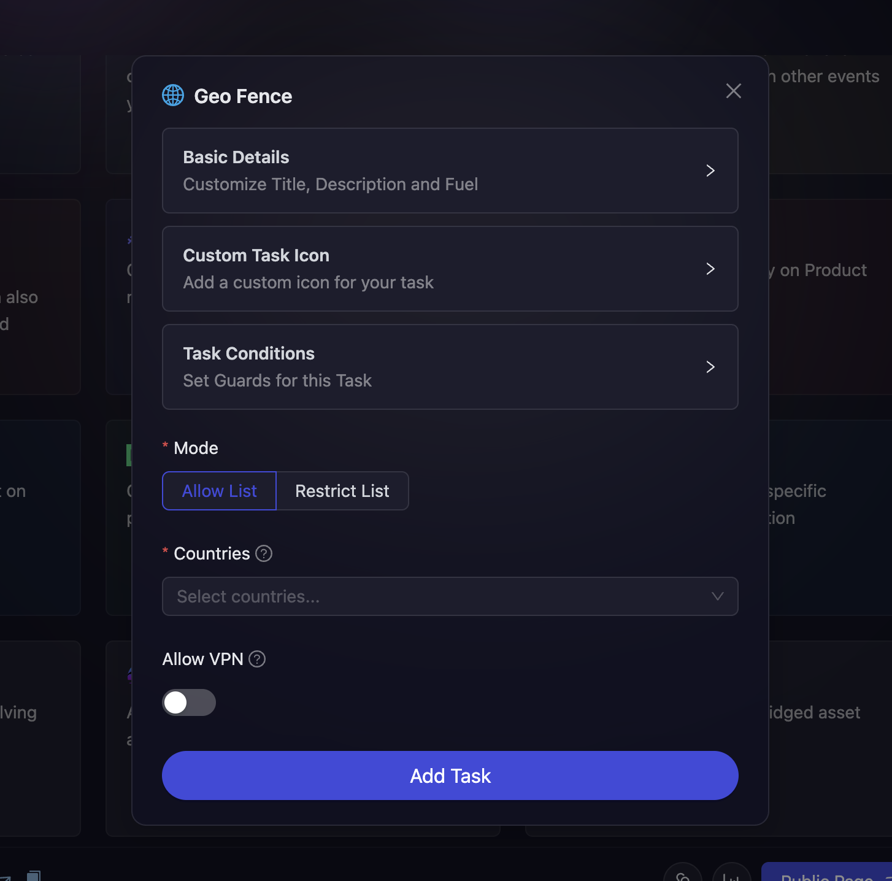

# Geo-Fence

Geo-Fence tasks allow you to control campaign participation based on geographical location. This powerful feature enables you to either allow participation only from specific countries or restrict participation from certain regions. It's particularly useful for compliance with local regulations, targeted regional campaigns, or creating location-specific experiences for your community.

- On the event page, click on Quests tab where you can find the **Geo-Fence** block.

  

- Configure the basic details for your Geo-Fence task. For detailed instructions on setting up basic details, refer to the [Quest Basic Details](../quest-basic-details.md) guide.

- To configure the **Task Condition & Recurrence**, refer to the [Task Condition & Recurrence](../task-condition-and-recurrence.md) page.

- Next, configure your geographical restrictions:

### Access Mode

Choose your access control mode:

- **Allow List**: Participation is only allowed from the selected countries
- **Restrict List**: Participation is allowed from all countries except those in the selected list

### Country Selection

- Select one or more countries from the **Countries** dropdown menu based on your access mode requirements

- The dropdown contains a comprehensive list of all countries to choose from

### VPN Settings

- **Allow VPN**: Toggle this option to allow or prevent participants from using VPN services to bypass geographical restrictions

  - **Enabled**: Participants can use VPNs to participate regardless of their actual location
  - **Disabled**: VPN usage is detected and blocked, ensuring participants are actually in the allowed geographical regions

  

- Finally, click on **Add Task** to create your Geo-Fence task.

:::tip For instant help

1. Create a support ticket on our Discord: https://discord.gg/bx6ZCTwbYw
2. Join [this Telegram group](https://t.me/kyteone): https://t.me/kyteone

**_The AirLyft Team is there to help you. AirLyft is a platform to run marketing events, campaigns, quests and automatically distribute NFTs or Tokens as rewards._**

:::
