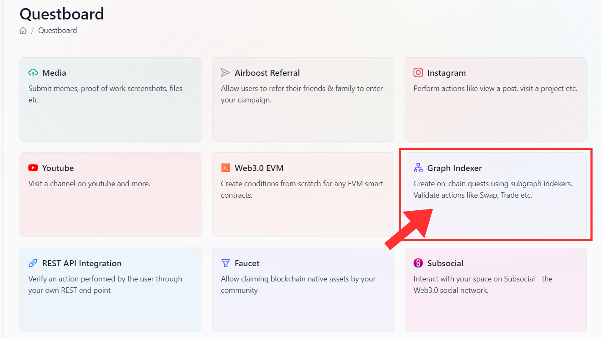
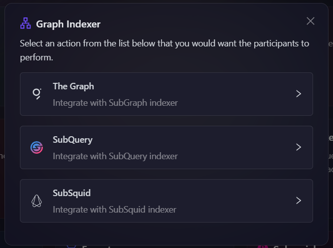
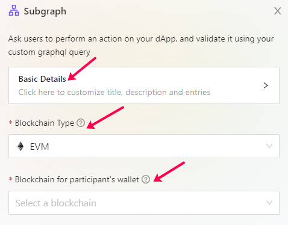
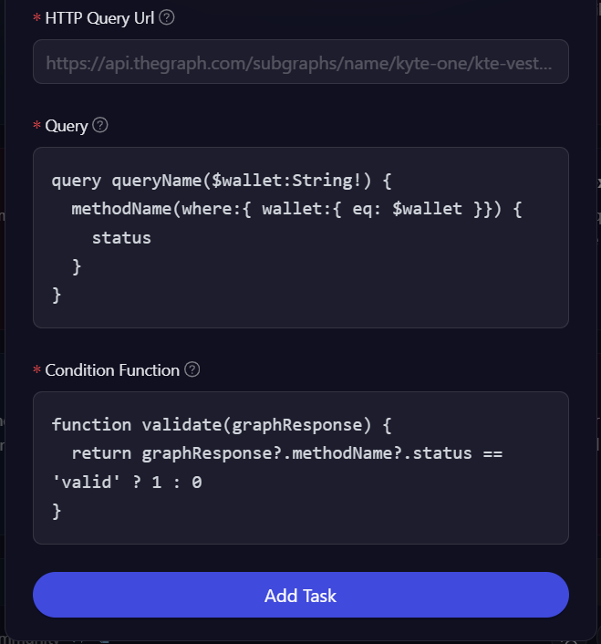

# Indexing Protocol Integrations

Indexing Protocol is a way used by applications to query open APIs to get data that has been indexed on the blockchain networks. And AirLyft is proud to let you know that you can use these indexing protocol integrations to put conditions on the on-chain stored data and create in-depth decentralized actions. We have successfully integrated 3 different and most used indexing protocols mentioned below.

    - SubGraph
    - SubQuery
    - SubSquid

Based on what indexing protocol is implemented at your product to store on-chain data, you can select based on your requirements and then move ahead with the creation of on-chain decentralized action. Let's take a deep dive look at how we can create a decentralized action using Indexing Protocol integration.

- Login to AirLyft and create an event. On the event page, click on the Quests tab where you can find the Graph Indexer integration block.

  

- Next, select the sort of indexing protocol your project supports and click on it.



- Expand the basic details option to enter the Title, Description, cFuel and XP. It is advisable to elaborate on the title and description so that participants have a much greater understanding of the task.

- To configure the **Task Condition & Recurrence**, refer to the [Task Condition & Recurrence](../task-condition-and-recurrence.md) page.

- After that, select the type of blockchain on which you want to create this on-chain decentralized action. i.e. EVM, Dotsama, or any upcoming blockchains.
- Next, select the Blockchain for the participant's wallet, the network on which a participant will be performing the on-chain task.

  

- The next part is a bit tricky and you might need your tech team's support on this as this requires you to enter the Query that will have the ability to query the data on-chain and check if the users connected wallet address is valid or not. And based on the requirement, you will then need to enter the condition function which is a JS function where you enter certain conditions such as
  - The user needs to stake a minimum or maximum of these tokens as part of the event.
  - They need to perform the required on-chain activity within a certain timeframe.
  - They need to collect these resources within the game.
  - Need to hold one NFT on any specific collection

The conditions functions and query can be anything based on how innovatively you are designing your decentralized task in a campaign.



While the above explanation gives a very vague idea of what each input box represents, let's take a look at creating a particular decentralized action.

Let's first look at how to create a swap action task.

- First, you need to enter the Query URL of your selected indexing protocol.
- Secondly, we have written a small query that calls the swapTest function on the query URL and checks if the particular wallet address has performed a swap for a specific time greater than the mentioned timestamp.

```query swapTest($wallet: ID!) {
  swaps(
    where:{
      from: $wallet
      timestamp_gt: "1671580800"
    }
  ) {
    id
  }
}
```

- Next is the condition function which checks if a swap was done or not by checking its length to be greater than 0.

```
function validation(data) {
 if(data.swaps && data.swaps.length > 0)
 {
  return 1;
 }
 return 0;
}
```

It's as simple as that. We understand that the first time can be a bit overwhelming but once the queries and conditional function are created, you can reuse the same set of codes for any of your upcoming campaigns where all you have to do is change specific values and not the entire code.

**Note: If you need any help on this, please feel free to contact Team AirLyft directly.**

:::tip For instant help

1. Create a support ticket on our Discord: https://discord.gg/bx6ZCTwbYw
2. Join [this Telegram group](https://t.me/kyteone): https://t.me/kyteone

**_The AirLyft Team is there to help you. AirLyft is a platform to run marketing events, campaigns, quests and automatically distribute NFTs or Tokens as rewards._**

:::
