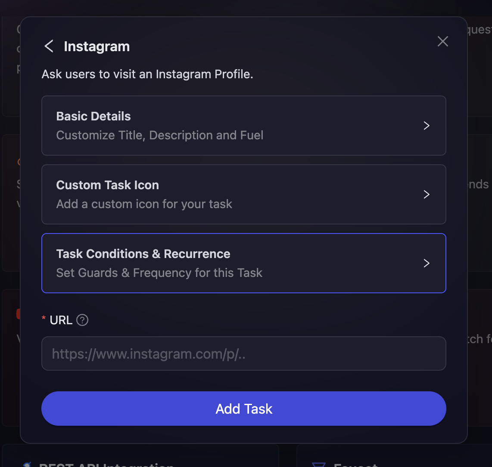

# Instagram

Certain projects have the need to create image/video contents that give users a better perspective of the platform they are trying to understand. With that in mind, AirLyft has now integrated Instagram and supports the creation of Instagram tasks in your upcoming campaign.

- On the event page, click on Quests tab where you can find the **Instagram** block.

  

- Next, projects will be provided with two specific actions i.e

  - **Visit Profile:** Use this option if you want users to visit a particular Instagram profile.
  - **View Post:** Use this option if you want users to visit a specific Instagram post.

  

- Select the required action, configure the basic details by referring to the [Quest Basic Details](../quest-basic-details.md) guide, set up task conditions using the [Task Condition & Recurrence](../task-condition-and-recurrence.md) page.

  

- Enter the URL of Instagram profile or post that you want your users to visit.

- Finally click on Add Task to add this to your campaign.

> **NOTE:** For Instagram, there were open end points earlier provided by the Facebook but due to recent Instagram API policy changes, validating actions won't be possible. They currently provide options to just visit a particular page or post via AirLyft. We can redirect participants to those particular page they need to follow but due to Instagram policy changes, we won't be able to verify if they have followed or liked.

:::tip For instant help

1. Create a support ticket on our Discord: https://discord.gg/bx6ZCTwbYw
2. Join [this Telegram group](https://t.me/kyteone): https://t.me/kyteone

**_The AirLyft Team is there to help you. AirLyft is a platform to run marketing events, campaigns, quests and automatically distribute NFTs or Tokens as rewards._**

:::
