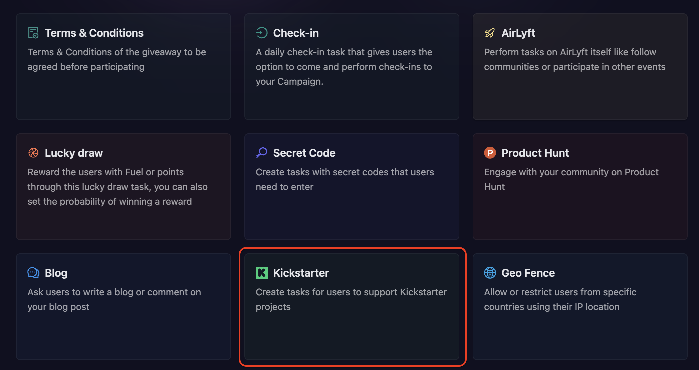
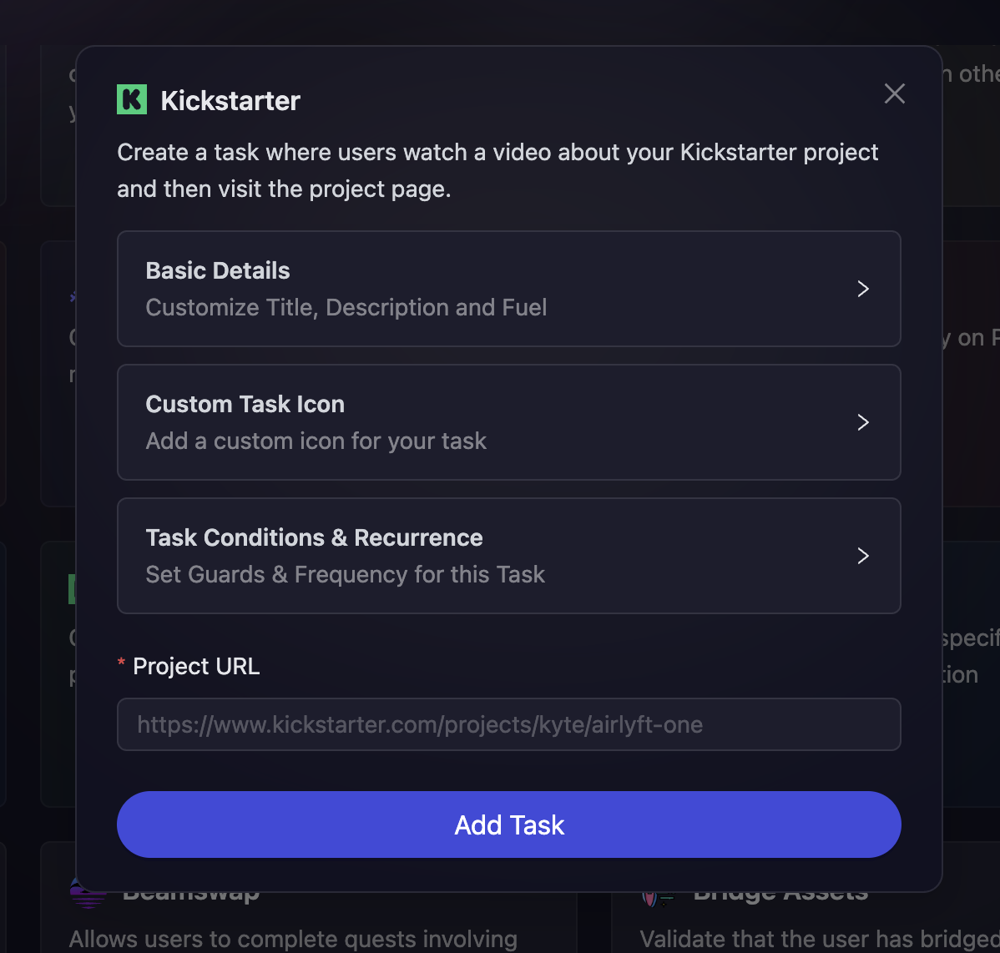

# Kickstarter

Kickstarter tasks help you drive awareness and engagement for your crowdfunding campaign. This task type encourages participants to watch your project video and visit your Kickstarter project page, helping increase visibility and potential backing for your campaign. It's an effective way to leverage your community to boost your Kickstarter project's reach and engagement.

- On the event page, click on Quests tab where you can find the **Kickstarter** block.

  

- Configure the basic details for your Kickstarter task. For detailed instructions on setting up basic details, refer to the [Quest Basic Details](../quest-basic-details.md) guide.

- To configure the **Task Condition & Recurrence**, refer to the [Task Condition & Recurrence](../task-condition-and-recurrence.md) page.

- Next, enter the **Project URL** of your Kickstarter project that you want participants to visit and engage with.

> Participants will be prompted to watch the project video and visit the project page to learn more about your campaign.

- Finally, click on **Add Task** to create your Kickstarter task.

:::tip For instant help

1. Create a support ticket on our Discord: https://discord.gg/bx6ZCTwbYw
2. Join [this Telegram group](https://t.me/kyteone): https://t.me/kyteone

**_The AirLyft Team is there to help you. AirLyft is a platform to run marketing events, campaigns, quests and automatically distribute NFTs or Tokens as rewards._**

:::
