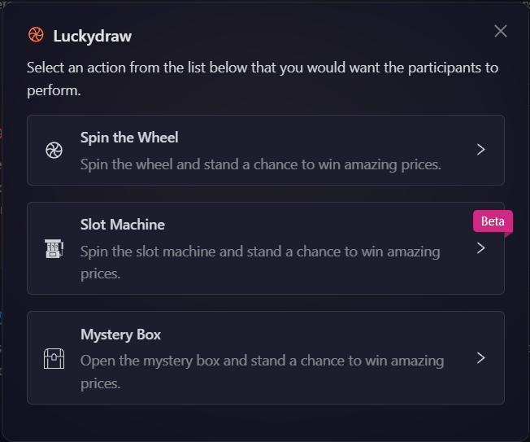
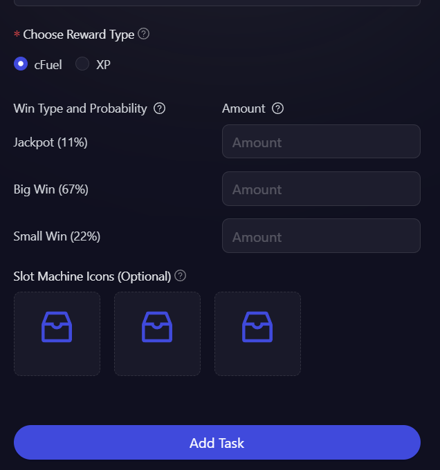

# Lucky Draw

Lucky Draw tasks add an exciting element of chance to your campaigns, helping boost participant engagement through gamification. Whether it's spinning a wheel, pulling a slot machine, or opening mystery boxes, these interactive rewards create memorable moments that keep your community coming back for more. It's a perfect way to make reward distribution more entertaining while encouraging active participation in your campaign.

## ✅ Steps to Create a Lucky Draw Task

### 1. Login to the AirLyft Dashboard

Go to [account.airlyft.one](https://account.airlyft.one) and log in to your project dashboard.

---

### 2. Create a Campaign

Click on **"Create Campaign"** and fill out the basic campaign details such as campaign name, description, and duration.

---

### 3. Choose the type of Lucky Draw you want to create

Within your campaign:

- Click on Quests tab and Choose the task type: **Lucky Draw**.

  

- There are three types of Lucky Draw tasks available:

  - [**Spin the Wheel**](#to-setup-spin-the-wheel-task): Participants spin the wheel to win rewards based on predefined probabilities.
  - [**Slot Machine**](#to-setup-slot-machine-task): Spin the slot machine and stand a chance to win amazing prices.
  - [**Mystery Box**](#to-setup-mystery-box-task): Open the mystery box and stand a chance to win amazing prices.

  

---

### 4. Configure Task Settings

Fill out the following details:

- **Task Title**: Name of the task
- **Points**: How many points to reward for successful submission

  

- Next, you can personalize the task further by adding a **custom task icon**.

  

- To configure the **Task Condition & Recurrence**, refer to the [Task Condition & Recurrence](../task-condition-and-recurrence.md) page.

- Choose the **reward type**, either **cFuel** or **XP**, based on what you want participants to receive.

---

#### To setup Spin The Wheel Task

- Enter the **reward amounts** and their respective **winning probabilities**. For example:

  - You can set up different reward tiers like:
    - 100 cFuel with 10% probability (rare reward)
    - 50 cFuel with 30% probability (uncommon reward)
    - 20 cFuel with 60% probability (common reward)

  

---

#### To setup Slot Machine Task

- Enter different amounts for predefined winning probabilities:

  - **Jackpot** (11%)
  - **Big Win** (67%)
  - **Small Win** (22%)

- Addtionally, you can set up **Slot Machine Icons**.

  

---

#### To setup Mystery Box Task

- Similar to **Spin the Wheel**, enter the **reward amounts** and their respective **winning probabilities**.

  

  The probabilities must add up to 100%. This setup ensures that different rewards have different chances of being won, creating an exciting and dynamic experience for participants. In the example above, when a user spins the wheel, they have a 60% chance to win 20 cFuel, a 30% chance to win 50 cFuel, and a 10% chance to win 100 cFuel.

---

### 5. Save the Task

Click **Add Task** to add the Lucky Draw task to your campaign. Once saved, the task will be live for participants to engage with.

:::tip For instant help

1. Create a support ticket on our Discord: https://discord.gg/bx6ZCTwbYw
2. Join [this Telegram group](https://t.me/kyteone): https://t.me/kyteone

**_The AirLyft Team is there to help you. AirLyft is a platform to run marketing events, campaigns, quests and automatically distribute NFTs or Tokens as rewards._**

:::
