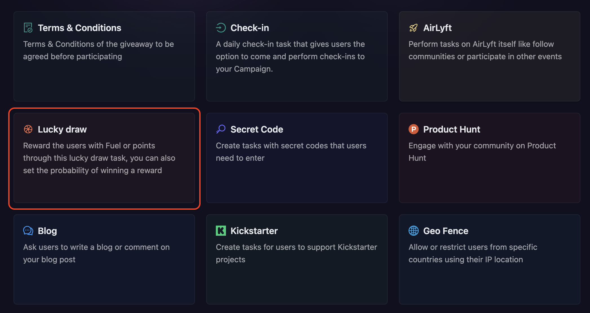
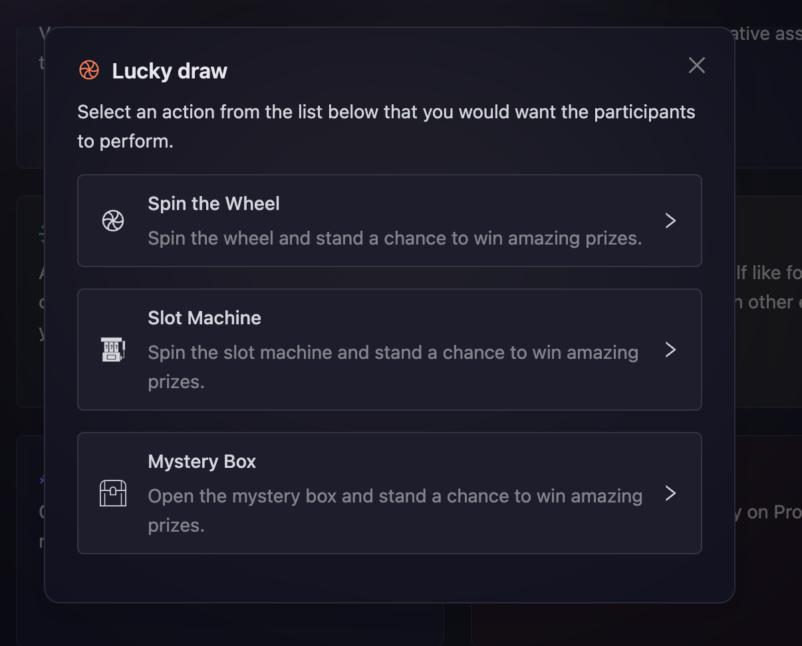
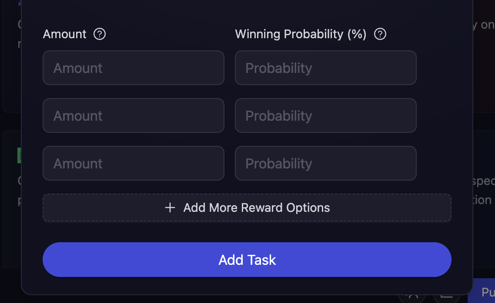
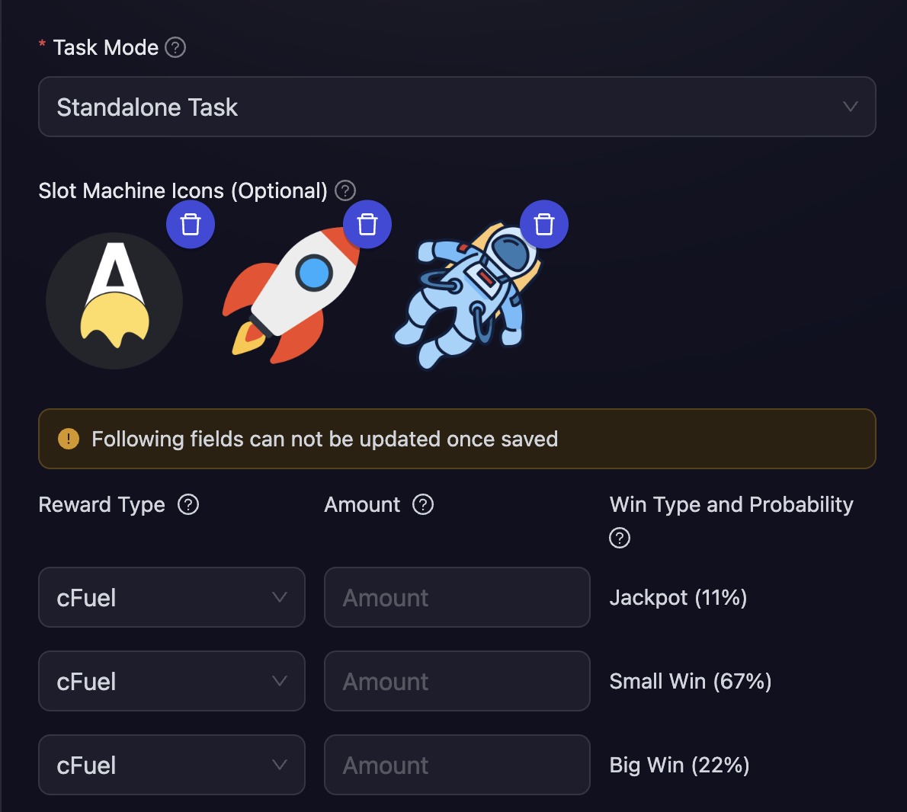

# Lucky Draw

Lucky Draw tasks add an exciting element of chance to your campaigns, helping boost participant engagement through gamification. Whether it's spinning a wheel, pulling a slot machine, or opening mystery boxes, these interactive rewards create memorable moments that keep your community coming back for more. It's a perfect way to make reward distribution more entertaining while encouraging active participation in your campaign.

- Click on Quests tab and choose the **Lucky Draw** task module.

  

- There are three types of Lucky Draw tasks available:

  - [**Spin the Wheel**](#to-setup-spin-the-wheel-task): Participants spin the wheel to win rewards based on predefined probabilities.
  - [**Slot Machine**](#to-setup-slot-machine-task): Spin the slot machine and stand a chance to win amazing prices.
  - [**Mystery Box**](#to-setup-mystery-box-task): Open the mystery box and stand a chance to win amazing prices.

  

- Next, configure the basic details for your form task. For detailed instructions on setting up basic details, refer to the [Quest Basic Details](../quest-basic-details.md) guide.

- To configure the **Task Condition & Recurrence**, refer to the [Task Condition & Recurrence](../task-condition-and-recurrence.md) page.

## Task Mode

Lucky Draw tasks offer two distinct modes of operation:

- **Standalone Task:** The task behaves like a regular quest task and is visible to all participants from the start. Users can complete it at any time during the campaign.

- **Bonus Reward:** The task remains hidden until specific conditions are met. You'll need to configure conditions in the **Task Condition & Recurrence** section. Once participants meet these conditions, the Lucky Draw task becomes visible and accessible to them. This mode is perfect for rewarding loyal participants or those who have achieved specific milestones.

## Configuring Rewards

Lucky Draw tasks support multiple reward types, and each reward tier can have a different type:

- **cFuel:** Award campaign fuel points
- **cXP:** Award experience points
- **Giveaway:** Award rewards from a Lucky Draw giveaway

You can mix and match reward types within the same Lucky Draw task. For example:

- Reward 1: 100 cFuel
- Reward 2: 50 cXP
- Reward 3: A giveaway reward (NFT, tokens, Discord roles, etc.)

### Using Giveaway Rewards

To use giveaway as a reward type, you must first create a giveaway with the [Lucky Draw distribution type](../rewards/winner-selection/luckydraw.md). Once created, you can select it while configuring your Lucky Draw task. Winners of the Lucky Draw task will automatically be entered into the giveaway based on what they win.

> **Important:** Once a reward is created with its probability, reward type, and amount, these values cannot be modified. Plan your reward structure carefully before adding the task.

#### To setup Spin The Wheel Task

- Select the **reward type** for each tier (cFuel, cXP, or Giveaway), enter the **reward amounts**, and set their respective **winning probabilities**. For example:

  You can add up to 10 reward tiers, and set them up like:

  - 100 cFuel with 10% probability (rare reward)
  - 50 cXP with 30% probability (uncommon reward)
  - Giveaway reward with 60% probability (common reward)

  

#### To setup Slot Machine Task

- In this task, the winning probabilities are predefined, but you can select the reward type (cFuel, cXP, or Giveaway) and manually set the reward amount for each tier. The predefined tiers and their probabilities are as follows:

  - **Jackpot:** All three slot icons are same (Winning Probability: 11%)
  - **Small Win:** All three slot icons are different (Winning Probability: 67%)
  - **Big Win:** Any two slot icons are same (Winning Probability: 22%)

- Each tier can have a different reward type. For example, Jackpot could award a Giveaway reward, Big Win could award cXP, and Small Win could award cFuel.

- Optionally, you can also add custom slot icons, or use the default ones.

  

#### To setup Mystery Box Task

- Similar to **Spin the Wheel**, select the **reward type** for each tier (cFuel, cXP, or Giveaway), enter the **reward amounts**, and set their respective **winning probabilities**.

  

- Click **Add Task** to add the Lucky Draw task to your campaign.

> **Note:** The probabilities must add up to 100%. This setup ensures that different rewards have different chances of being won, creating an exciting and dynamic experience for participants. Each reward tier can have a different reward type, allowing you to create diverse prize pools that include cFuel, cXP, and giveaway rewards.

:::tip For instant help

1. Create a support ticket on our Discord: https://discord.gg/bx6ZCTwbYw
2. Join [this Telegram group](https://t.me/kyteone): https://t.me/kyteone

**_The AirLyft Team is there to help you. AirLyft is a platform to run marketing events, campaigns, quests and automatically distribute NFTs or Tokens as rewards._**

:::
