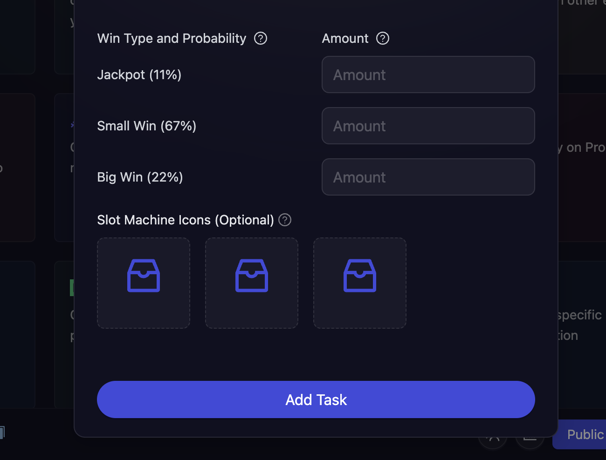

# Lucky Draw

Lucky Draw tasks add an exciting element of chance to your campaigns, helping boost participant engagement through gamification. Whether it's spinning a wheel, pulling a slot machine, or opening mystery boxes, these interactive rewards create memorable moments that keep your community coming back for more. It's a perfect way to make reward distribution more entertaining while encouraging active participation in your campaign.

- Click on Quests tab and choose the **Lucky Draw** task module.

  

- There are three types of Lucky Draw tasks available:

  - [**Spin the Wheel**](#to-setup-spin-the-wheel-task): Participants spin the wheel to win rewards based on predefined probabilities.
  - [**Slot Machine**](#to-setup-slot-machine-task): Spin the slot machine and stand a chance to win amazing prices.
  - [**Mystery Box**](#to-setup-mystery-box-task): Open the mystery box and stand a chance to win amazing prices.

  

- Next, configure the basic details for your form task. For detailed instructions on setting up basic details, refer to the [Quest Basic Details](../quest-basic-details.md) guide.

- To configure the **Task Condition & Recurrence**, refer to the [Task Condition & Recurrence](../task-condition-and-recurrence.md) page.

- Choose the **reward type**, you can either choose between cFuel or XP.

#### To setup Spin The Wheel Task

- Enter the **reward amounts** and their respective **winning probabilities**. For example:

  You can add upto 10 reward tiers, and set them up like:

  - 100 cFuel with 10% probability (rare reward)
  - 50 cFuel with 30% probability (uncommon reward)
  - 20 cFuel with 60% probability (common reward)

  

#### To setup Slot Machine Task

- In this task, the winning probabilities are predefined, but you can manually set the reward amount for each tier. The predefined tiers and their probabilities are as follows:

  - **Jackpot:** All three slot icons are same (Winning Probaiity: 11%)
  - **Small Win:** All three slot icons are different (Winning Probaiity: 67%)
  - **Big Win:** Any two slot icons are same (Winning Probaiity: 22%)

- Optionally, you can also add custom slot icons, or use the default ones.

  

#### To setup Mystery Box Task

- Similar to **Spin the Wheel**, enter the **reward amounts** and their respective **winning probabilities**.

  

- Click **Add Task** to add the Lucky Draw task to your campaign.

> **Note:** The probabilities must add up to 100%. This setup ensures that different rewards have different chances of being won, creating an exciting and dynamic experience for participants. In the example above, when a user spins the wheel, they have a 60% chance to win 20 cFuel, a 30% chance to win 50 cFuel, and a 10% chance to win 100 cFuel.

:::tip For instant help

1. Create a support ticket on our Discord: https://discord.gg/bx6ZCTwbYw
2. Join [this Telegram group](https://t.me/kyteone): https://t.me/kyteone

**_The AirLyft Team is there to help you. AirLyft is a platform to run marketing events, campaigns, quests and automatically distribute NFTs or Tokens as rewards._**

:::
